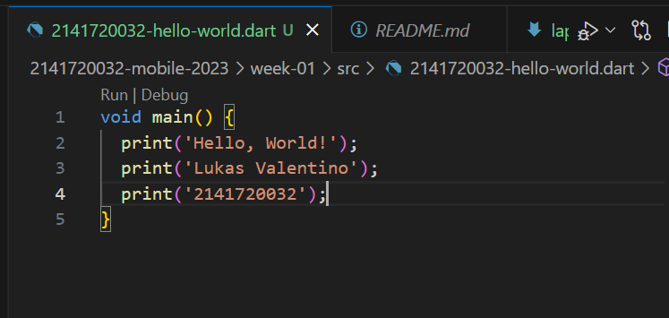

# *Laporan Praktikum Pemrograman Mobile*
# *Pertemuan 1*

## *Data Mahasiswa*
>

>
Nama : Lukas Valentino

>Kelas : 3H

>Prodi : D-IV Teknik Informatika

>Jurusan : Teknologi Informasi

>
 Politeknik Negeri Malang
 

 

## 2.1 Tujuan Praktikum
Setelah melakukan materi praktikum ini, mahasiswa mampu:

1. Melakukan Instalasi Dart
2. Menjalankan Dart

 

## 2.2 Melakukan instalasi Dart

## 2.2.1 Langkah-langkah Menginstall Dart
1. Download dart pada https://dart.dev/get-dart/archive

    >Download dart-sdk
    >>
    >extract file yang telah didownload
    >>
    >Pindahkan file yang telah diwonload tadi ke C
    >>

2. Lakukan konfigurasi path
    >Melakukan setting pada enviroment tables
    >>
    >>

3. Cek Dart Version
>Buka terminal, kemudian cek dart --version
>>

## 2.3 Menjalankan Dart

1. Create file dart dengan nama berikut 2141720032-hello-world.dart
>>

2. Run file dart
>>

