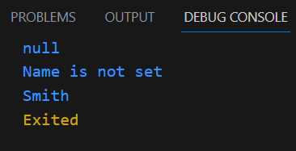
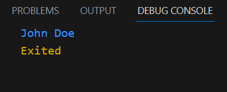

# **Laporan Praktikum**
# **Pertemuan 2**
## **Variabel dan tipe data pada pemrograman DART**


<!-- ><center></center> -->
## **1.1 Data Anggota Kelompok**


<br>

## 2.1 Tujuan Praktikum
Setelah melakukan materi praktikum ini, mahasiswa mampu:

1. Mahasiswa mampu menerapkan pembuatan variable di dalam Bahasa Pemrograman DART
2. Mahasiswa mampu melakukan penyesuaian tipe data berdasar variabelnya di pemrograman DART

<br>

## 2.2 Tugas Kelompok 
Buatlah slide yg berisi penjelasan dan contoh eksekusi kode tentang perbedaan Null Safety dan Late variabel !


## 2.2.1 Null Safety
1. Pengertian Null Safety
Null safety adalah fitur Dart yang memungkinkan Anda untuk mendeteksi dan menangani nilai null dengan lebih aman. Sebelum null safety, nilai null dapat dilewatkan ke fungsi atau variabel tanpa peringatan. Hal ini dapat menyebabkan kesalahan runtime yang sulit untuk didiagnosis.Null safety adalah fitur penting yang dapat membantu Anda untuk menulis kode yang lebih aman dan bebas error.
2. Berikut Perbedaan Null Safety ! pada Dart

    - Semua variabel pada Dart secara default adalah non-nullable, artinya variabel tersebut harus memiliki nilai awal.
    - Variabel nullable dapat dideklarasikan dengan menambahkan tanda tanya (?) setelah tipe datanya.
    - Variabel nullable dapat bernilai null, yaitu nilai kosong.
<br>
<br>

3. Berikut penjelasan code menggunakan Null Safety pada Dart


    ``` dart
    void main() {
        String? name;
        name = null;
        print(name);
        if (name != null) {
        print(name);
    } else {
        print("Name is not set");
    }
    String lastName = "Smith";
    print(lastName);
    }
    ```
    Berikut hasil Outputnya<p>
    


    
## 2.2.2 Late variabel 
1. Pengertian Late Variabel
Late variable adalah variabel yang tidak dapat diakses sebelum diset nilainya. Late variable dapat digunakan untuk menunda inisialisasi variabel sampai variabel tersebut diperlukan.
Late variable dapat digunakan untuk menunda inisialisasi variabel sampai variabel tersebut diperlukan. Hal ini dapat berguna jika Anda tidak yakin nilai variabel apa yang akan digunakan.


2. Berikut Perbedaan Late variabel ! pada Dart

    - Variabel late adalah variabel non-nullable yang diinisialisasi nanti.
    - Variabel late tidak dapat diakses sebelum diinisialisasi.
    - Variabel late dapat dideklarasikan dengan menambahkan kata kunci late sebelum tipe datanya.

3. Berikut penjelasan code menggunakan Late Variabel pada Dart
    ```Dart
    void main() {
        late String name;
        name = "John Doe";
        print(name);
        }
    ```
    Berikut hasil Outputnya<p>
    

<br>


