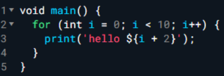
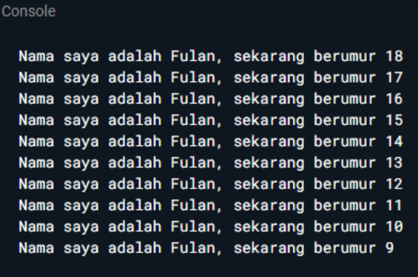
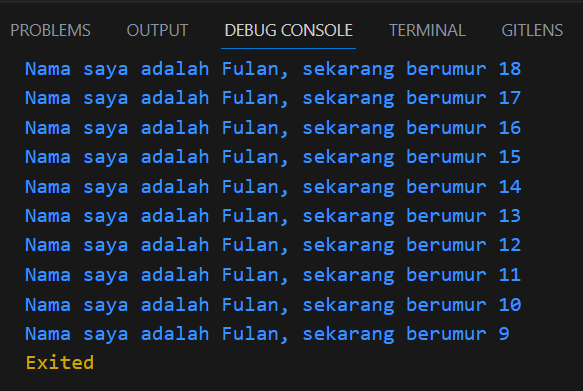

# **Laporan Praktikum**
# **Pertemuan 2**
## **Variabel dan tipe data pada pemrograman DART**


## **1.1 Data Mahasiswa**
><center></center>

><p>Nama : Lukas Valentino<p>
>Kelas : 3H<p>
>Prodi : D-IV Teknik Inormatika<p>
>Jurusan : Teknologi Inormasi<p>
><center> Politeknik Negri Malang</center> 

<br>

## 2.1 Tujuan Praktikum
Setelah melakukan materi praktikum ini, mahasiswa mampu:

1. Mahasiswa mampu menerapkan pembuatan variable di dalam BahasaPemrograman DART
2. Mahasiswa mampu melakukan penyesuaian tipe data berdasar variabelnya di pemrograman DART

<br>

## 3.1 Tugas Praktikum

## SOAL 1
Modifikasilah kode pada baris 3 di VS Code atau Editor Code favorit Anda berikut ini agar mendapatkan keluaran (output) sesuai yang diminta!<p>
    <p>
Output yang diminta:<p>
    <p>

**JAWAB**
<br>

```dart
void main() {
  for (int i = 18; i >= 9; i--) {
    print('Nama saya adalah Fulan, sekarang berumur $i');
  }
}
```

**Hasil Output** <br>
 

<br>

## SOAL 2
Mengapa sangat penting untuk memahami bahasa pemrograman Dart sebelum kita menggunakan framework Flutter ? Jelaskan!

**JAWAB** <br>
Pengetahuan tentang Dart memungkinkan pengembang untuk menguasai, menulis, dan memahami kode Flutter dengan lebih baik. Hal ini juga mendukung dalam proses debugging, pemahaman konsep-konsep dasar pemrograman seperti pengaturan widget, manajemen state, dan routing, serta memberi kemampuan untuk menyesuaikan aplikasi Flutter sesuai kebutuhan dengan menulis kode Dart khusus.
<br><br>
Jadi mempunyai peran penting dalam mengoptimalkan kode, mencegah kesalahan umum, dan memilih struktur data yang tepat. Selain itu, memahami Dart membantu pengembang untuk tetap terhubung dengan perkembangan terbaru dalam ekosistem Flutter, sehingga lebih siap mengikuti perubahan dan peningkatan dalam bahasa tersebut.
<br>

## SOAL 3
Rangkumlah materi dari codelab ini menjadi poin-poin penting yang dapat Anda gunakan untuk membantu proses pengembangan aplikasi mobile menggunakan framework Flutter.

**JAWAB**<br>
Dart dirancang untuk menggabungkan kelebihan dari bahasa tingkat tinggi dan fitur bahasa pemrograman terkini, termasuk produktivitas alat, manajemen memori, notasi tipe opsional, notasi tipe statis, dan portabilitas, yang semuanya mendukung pengembangan dalam framework Flutter yang sepenuhnya menggunakan Dart.
<br><br>
Dart awalnya ditujukan untuk menggantikan JavaScript dalam pengembangan web, kemudian berkembang menjadi bahasa fokus untuk pengembangan mobile, dengan perubahan besar dalam rilis Dart 2.0 pada akhir 2018, yang menawarkan performa terbaik, alat yang lebih baik, dan kekuatan serta fleksibilitas dalam bahasa pemrograman, menjadikannya pilihan utama untuk framework Flutter.
<br><br>
Kode Dart dapat dieksekusi dalam dua mode, yaitu kompilasi Just-In-Time (JIT) untuk pengembangan dan kompilasi Ahead-Of-Time (AOT) untuk performa yang lebih baik, dengan masing-masing mode memiliki keuntungan dan keterbatasan tersendiri.
<br>

## SOAL 4
Buatlah slide yang berisi penjelasan dan contoh eksekusi kode tentang perbedaan Null Safety dan Late variabel ! (Khusus soal ini kelompok berupa link google slide)

Kumpulkan jawaban Anda di spreadsheet pada tautan yang telah disediakan di grup telegram. Untuk soal nomor 1 sampai 3 push repo GitHub Anda.

**JAWAB**<p>
Berikut adalah Jawaban dari Tugas Soal nomor 4<p>
- [Power Point (klik)](https://www.canva.com/design/DAFtchccz5M/boMG7y_wubQaq-4roL2ouw/view?utm_content=DAFtchccz5M&utm_campaign=designshare&utm_medium=link&utm_source=publishsharelink)<p>
- [Markdown (Klik)](Laporan_Kelompok.md)<p>