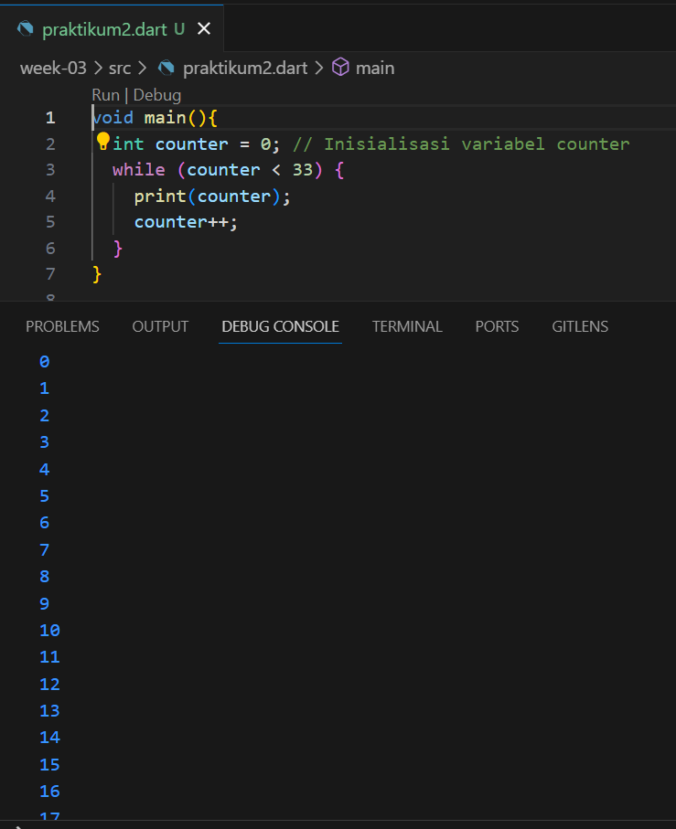
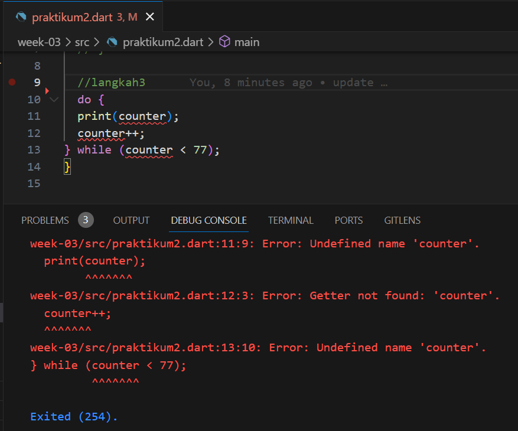

# **Laporan Praktikum**
# **Pertemuan 3**
### **Percabangan pada pemrograman DART, Perulangan pada pemrograman DART, Operasi Gi**
------


### **Data Mahasiswa**


><p>Nama : Lukas Valentino<p>
>NIM : 2141720032<p>
>Kelas : 3H<p>
>Prodi : D-IV Teknik Inormatika<p>
>Jurusan : Teknologi Inormasi<p>


<br>

### **Tujuan Praktikum**
Setelah melakukan materi praktikum ini, mahasiswa mampu:

1. Menerapkan control flows pada bahasa pemrograman Dart
2. Menerapkan perulangan pada bahasa pemrograman Dart

<br>

---------
<br>

### **Praktikum 1: Menerapkan Control Flows ("if/else")**
Selesaikan langkah-langkah praktikum berikut ini menggunakan DartPad di browser Anda.

### **Langkah 1**
Ketik atau salin kode program berikut ke dalam fungsi main().

```dart
String test = "test2";
if (test == "test1") {
   print("Test1");
} else If (test == "test2") {
   print("Test2");
} Else {
   print("Something else");
}

if (test == "test2") print("Test2 again");
```

### **Langkah 2**
Silakan coba eksekusi (Run) kode pada langkah 1 tersebut. Apa yang terjadi? Jelaskan!

**JAWAB**
<p>
Terdapat beberapa masalah penulisan yang dapat menyebabkan error. </p>
<p>

Terdapat beberapa masalah yaitu :

- Menggunakan huruf besar untuk kata kunci If dan Else, tetapi dalam Dart, kata kunci ini harus ditulis dalam huruf kecil, yaitu if dan else.

- Menggunakan Else If (dengan huruf besar) yang seharusnya ditulis sebagai else if (dengan huruf kecil).

Dalam kondisi if, seharusnya membandingkan variabel test dengan "test1", sedangkan pada kode diatas membandingkannya dengan "test2" sesuai dengan nilai yang sudah diberikan pada variabel test.

Berikut adalah kode yang diperbaiki
```dart
void main() {
  String test = "test2";
  if (test == "test1") {
    print("Test1");
  } else if (test == "test2") {
    print("Test2");
  } else {
    print("Something else");
  }

  if (test == "test2") {
    print("Test2 again");
  }
}
```

Berikut adalah hasil screenshot kode program.
</p>
<p>

### **Langkah 3**
Tambahkan kode program berikut, lalu coba eksekusi (Run) kode Anda.

```dart
String test = "true";
if (test) {
   print("Kebenaran");
}
```
Apa yang terjadi ? Jika terjadi error, silakan perbaiki namun tetap menggunakan if/else.

**JAWAB**<p>
berikut adalah hasil eksekusi setelah menambahkan kode pada langkah 3 diatas<p>
<p>
Terdapat beberapa masalah dan error yaitu :

- Menguji kondisi if menggunakan sebuah string "true". Namun, dalam Dart, kondisi dalam pernyataan if harus berupa ekspresi boolean (true atau false), bukan string. Oleh karena itu, akan terjadi error saat mencoba menguji string sebagai kondisi.
- Selain itu, harus mengubah "true" ke boolean true jika Anda ingin mencetak pesan "Kebenaran" ketika kondisinya benar.

Berikut adalah kode yang diperbaiki:

```dart
void main() {
  bool test = true; // Menggunakan boolean true
  if (test) {
    print("Kebenaran");
  }
}
```
Dalam kode yang diperbaiki, variabel test telah dideklarasikan sebagai boolean true, dan kode akan berfungsi dengan benar. Ini akan mencetak "Kebenaran" karena kondisi if terpenuhi.
<br>
Berikut adalah hasil screenshot kode program.<p>
<p>


### **Praktikum 2: Menerapkan Perulangan "while" dan "do-while"**
Selesaikan langkah-langkah praktikum berikut ini menggunakan DartPad di browser Anda.

### **Langkah 1**
Ketik atau salin kode program berikut ke dalam fungsi main().

```dart
while (counter < 33) {
  print(counter);
  counter++;
}
```

### **Langkah 2**
Silakan coba eksekusi (Run) kode pada langkah 1 tersebut. Apa yang terjadi? Jelaskan! Lalu perbaiki jika terjadi error.

**JAWAB**<p>
Terdapat beberapa masalah yang dapat menyebabkan error saat dieksekusi.<p>
<p>
Error terjadi karena ariabel counter tidak dideklarasikan atau diinisialisasi sebelum digunakan.
Jadi perlu mendeklarasikan dan menginisialisasi variabel counter sebelum menggunakannya. Misalnya, bisa menambahkan baris berikut sebelum loop while:

```dart
int counter = 0;
```
Kode lengkap yang diperbaiki akan menjadi:

```dart
void main(){
  int counter = 0; // Inisialisasi variabel counter
  while (counter < 33) {
    print(counter);
    counter++;
  }
}
```
<p>
Dengan demikian, kode tersebut akan berfungsi dengan baik. Itu akan mencetak angka dari 0 hingga 32 ke layar console.

### **Langkah 3**
Tambahkan kode program berikut, lalu coba eksekusi (Run) kode Anda.

```dart
do {
  print(counter);
  counter++;
} while (counter < 77);
```
Apa yang terjadi ? Jika terjadi error, silakan perbaiki namun tetap menggunakan do-while.

**JAWAB**<p>
Terdapat masalah yang akan menyebabkan error jika dijalankan.<p>
<p>
Perlu mendeklarasikan dan menginisialisasi variabel counter sebelum menggunakannya, sama seperti yang telah saya sebutkan dalam langkah sebelumnya.<p>

Berikut adalah kode yang diperbaiki:

```dart
void main(){
  int counter = 0; // Inisialisasi variabel counter
  do {
    print(counter);
    counter++;
  } while (counter < 77);
}

```
Dengan tambahan inisialisasi variabel counter, kode tersebut akan berfungsi dengan baik. Itu akan mencetak angka dari 0 hingga 76 ke layar console.<p>
<p>

### **Praktikum 3:  Praktikum 3: Menerapkan Perulangan "for" dan "break-continue"**
Selesaikan langkah-langkah praktikum berikut ini menggunakan DartPad di browser Anda.

### **Langkah 1**
Ketik atau salin kode program berikut ke dalam fungsi main().

```dart
for (Index = 10; index < 27; index) {
  print(Index);
}
```

### **Langkah 2**
Silakan coba eksekusi (Run) kode pada langkah 1 tersebut. Apa yang terjadi? Jelaskan! Lalu perbaiki jika terjadi error.

**JAWAB**<p>
Terdapat beberapa masalah yang dapat menyebabkan error saat dieksekusi.<p>
<p>

- Variabel Index tidak dideklarasikan atau diinisialisasi sebelum digunakan.
- Dalam loop for, tidak dapat melakukan peningkatan nilai variabel Index. Oleh karena itu, loop ini akan menjadi loop tak berujung, yang akan mengakibatkan program berhenti merespons atau hang.
- Untuk memperbaiki kode tersebut, perlu mendeklarasikan dan menginisialisasi variabel Index, serta menambahkan langkah peningkatan nilai variabel Index dalam loop for. 

Berikut adalah kode yang diperbaiki:

```dart
void main(){
  for (int Index = 10; Index < 27; Index++) {
    print(Index);
  }
}
```

Dengan perbaikan ini, kode akan berfungsi dengan baik. Itu akan mencetak angka dari 10 hingga 26 ke layar console
<p>


### **Langkah 3**
Tambahkan kode program berikut di dalam for-loop, lalu coba eksekusi (Run) kode Anda.

```dart
If (Index == 21) break;
Else If (index > 1 || index < 7) continue;
print(index);
```
Apa yang terjadi ? Jika terjadi error, silakan perbaiki namun tetap menggunakan for dan break-continue.

**JAWAB**<p>
Terdapat beberapa masalah yang perlu diperbaiki sebelum kode dapat dijalankan dengan benar<p>
<p>
hal tersebut terjadi karena penggunaan If dan Else If harus diganti menjadi if dan else if dengan huruf kecil, penambahan kurung kurawal {} untuk mengelompokkan pernyataan di dalam blok if dan else if, gunakan huruf kecil index saat membandingkan nilai dalam pernyataan if dan else if. dan berikut hasil modifikasi kode programnya

```dart
void main() {
  for (int index = 10; index < 27; index++) {
    if (index == 21){
      break;
    }
    else if (index > 1 && index < 7){
      continue;
    }
    
    print(index);
  }
}
```
<p>

Berikut tambahan video materi terkait .<p>
- [Youtube Dart FOR Loop and how it works internally. Dart Tutorial for Flutter(klik)](https://www.youtube.com/watch?v=BCiyJOb7X-w&t=4s)<p>

----
<br>

### **Tugas Praktikum**
1. Silakan selesaikan Praktikum 1 sampai 3, lalu dokumentasikan berupa screenshot hasil pekerjaan beserta penjelasannya!<p>

**Jawab**<p>
- [Praktikum 1 (klik)](#praktikum-1-menerapkan-control-flows-ifelse)
- [Praktikum 2 (klik)](#praktikum-2-menerapkan-perulangan-while-dan-do-while)
- [Praktikum 3 (klik)](#praktikum-3-praktikum-3-menerapkan-perulangan-for-dan-break-continue)
<p>

2. Buatlah sebuah program yang dapat menampilkan bilangan prima dari angka 0 sampai 201 menggunakan Dart. Ketika bilangan prima ditemukan, maka tampilkan nama lengkap dan NIM Anda.<p>
**Jawab**<p>


3. Kumpulkan berupa link commit repo GitHub pada tautan yang telah disediakan di grup Telegram!