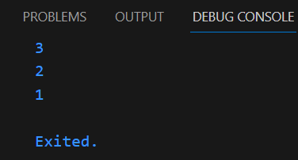

# **Laporan Praktikum**
# **Pertemuan 4**
### **Percabangan pada pemrograman DART, Perulangan pada pemrograman DART, Operasi Gi**
------


### **Data Mahasiswa**
><center></center>

><p>Nama : Lukas Valentino<p>
>NIM : 2141720032<p>
>Kelas : 3H<p>
>Prodi : D-IV Teknik Inormatika<p>
>Jurusan : Teknologi Inormasi<p>


<br>

### **Tujuan Praktikum**
Setelah menyelesaikan codelab ini Anda akan mampu untuk:

1. Menerapkan collections pada bahasa pemrograman Dart
2. Menerapkan records pada bahasa pemrograman Dart
3. Menerapkan functions pada bahasa pemrograman Dart

<br>

---------
<br>

### **Praktikum 1: Eksperimen Tipe Data List**
Selesaikan langkah-langkah praktikum berikut ini menggunakan VS Code atau Code Editor favorit Anda.

### **Langkah 1**
Ketik atau salin kode program berikut ke dalam fungsi main().

```dart
void main(){
    var list = [1, 2, 3];
    assert(list.length == 3);
    assert(list[1] == 2);
    print(list.length);
    print(list[1]);

    list[1] = 1;
    assert(list[1] == 1);
    print(list[1]);
}
```

### **Langkah 2**
Silakan coba eksekusi (Run) kode pada langkah 1 tersebut. Apa yang terjadi? Jelaskan!

**JAWAB**<p>
Dari hasil eksekusi pada langkah 1 diatas dihasilkan output seperti gambar dibawah ini<p>
<p>
Pada langkah pertama dari kode di atas, menginisialisasi sebuah list yang berisi tiga angka. Setelah itu, melakukan dua tindakan penting: pertama, memeriksa dan mencetak panjang list serta nilai dari elemen kedua dalam list tersebut. Kemudian, mengubah nilai elemen kedua dari list tersebut. Setelah perubahan dilakukan, memeriksa dan mencetak nilai elemen kedua yang telah diubah.<p>

### **Langkah 3**
Ubah kode pada langkah 1 menjadi variabel final yang mempunyai index = 5 dengan default value = null. Isilah nama dan NIM Anda pada elemen index ke-1 dan ke-2. Lalu print dan capture hasilnya.

Apa yang terjadi ? Jika terjadi error, silakan perbaiki.

**JAWAB**<p>

```dart
void main(){
  List<String?> finalList = List.filled(5, null);
  finalList[1] = "Lukas Valentino"; 
  finalList[2] = "2141720032";

  print(finalList.length);
  print(finalList[1]);
  print(finalList[2]); 
}
```
Dengan hasil output sebagai berikut <p>
<p>
Kode tersebut menginisialisasi sebuah list dengan nama "list" yang memiliki kapasitas untuk 5 elemen awalnya diisi dengan nilai null. Setelah itu, program mengubah nilai elemen pertama dari list dengan 'Lukas Valentino' dan nilai elemen kedua dengan '2141720032'.<p>


<br>

### **Praktikum 2: Eksperimen Tipe Data Set"**
Selesaikan langkah-langkah praktikum berikut ini menggunakan VS Code atau Code Editor favorit Anda.

### **Langkah 1**
Ketik atau salin kode program berikut ke dalam fungsi main().

```dart
void main(){
var halogens = {'fluorine', 'chlorine', 'bromine', 'iodine', 'astatine'};
print(halogens);
}
```

### **Langkah 2**
Silakan coba eksekusi (Run) kode pada langkah 1 tersebut. Apa yang terjadi? Jelaskan! Lalu perbaiki jika terjadi error.

**JAWAB**<p>
Dari hasil eksekusi pada langkah 1 diatas dihasilkan output seperti gambar dibawah ini<p>
<p>
Kode yang diberikan adalah kode untuk membuat sebuah Set dengan nama "halogens" yang berisi unsur-unsur halogen. Set adalah koleksi yang tidak memiliki indeks, dan unsur-unsur dalam Set tidak memiliki urutan tertentu. 

Setiap kali kode ini dijalankan, urutan elemen dalam Set mungkin berbeda-beda karena Set tidak mempertahankan urutan tertentu. Namun, semua elemen yang diberikan dalam Set akan ada dalam output.<p>

### **Langkah 3**
Tambahkan kode program berikut, lalu coba eksekusi (Run) kode Anda.

```dart
void main(){
    var names1 = <String>{};
    Set<String> names2 = {}; // This works, too.
    var names3 = {}; // Creates a map, not a set.

    print(names1);
    print(names2);
    print(names3);
}
```
Apa yang terjadi ? Jika terjadi error, silakan perbaiki namun tetap menggunakan ketiga variabel tersebut. Tambahkan elemen nama dan NIM Anda pada kedua variabel Set tersebut dengan dua fungsi berbeda yaitu .add() dan .addAll(). Untuk variabel Map dihapus, nanti kita coba di praktikum selanjutnya.

Dokumentasikan code dan hasil di console, lalu buat laporannya.

**JAWAB**<p>
Berikut adalah hasil output setelah menambahkan kode program diatas<p>
<p>
Kemudian saya menambahkan kode untuk menambahkan elemen nama dan NIM pada variabel Set: pada kode program diatas hingga menjadi sperti dibawah ini<p>

```dart
void main() {
    var names1 = <String>{};
    Set<String> names2 = {};

    names1.add("Lukas Valentino");
    names1.add("2141720032");

    names2.addAll({"Lukas Valentino", "2141720032"});

    print(names1);
    print(names2);
}
```
Dalam kode di atas, menggunakan .add() untuk menambahkan elemen satu per satu ke names1, dan .addAll() untuk menambahkan elemen dari sebuah Set ke names2. Hasilnya adalah:<p>
<p>

----
<br>

### **Praktikum 3: Eksperimen Tipe Data Maps"**
Selesaikan langkah-langkah praktikum berikut ini menggunakan VS Code atau Code Editor favorit Anda.

### **Langkah 1**
Ketik atau salin kode program berikut ke dalam fungsi main().

```dart
var gifts = {
  // Key:    Value
  'first': 'partridge',
  'second': 'turtledoves',
  'fifth': 1
};

var nobleGases = {
  2: 'helium',
  10: 'neon',
  18: 2,
};

print(gifts);
print(nobleGases);
```

### **Langkah 2**
Silakan coba eksekusi (Run) kode pada langkah 1 tersebut. Apa yang terjadi? Jelaskan! Lalu perbaiki jika terjadi error.

**JAWAB**<p>
Dari hasil eksekusi pada langkah 1 diatas dihasilkan output seperti gambar dibawah ini<p>
<p>
Variabel gifts menyimpan objek dengan tiga properti: first, second, dan fifth. Properti first memiliki nilai "partridge", properti second memiliki nilai "turtledoves", dan properti fifth memiliki nilai 1.
Variabel nobleGases menyimpan objek dengan tiga properti: 2, 10, dan 18. Properti 2 memiliki nilai "helium", properti 10 memiliki nilai "neon", dan properti 18 memiliki nilai 2.
</p>


### **Langkah 3**
Tambahkan kode program berikut, lalu coba eksekusi (Run) kode Anda.

```dart
var mhs1 = Map<String, String>();
gifts['first'] = 'partridge';
gifts['second'] = 'turtledoves';
gifts['fifth'] = 'golden rings';

var mhs2 = Map<int, String>();
nobleGases[2] = 'helium';
nobleGases[10] = 'neon';
nobleGases[18] = 'argon';
```

Apa yang terjadi ? Jika terjadi error, silakan perbaiki.

Tambahkan elemen nama dan NIM Anda pada tiap variabel di atas (gifts, nobleGases, mhs1, dan mhs2). Dokumentasikan hasilnya dan buat laporannya!

**JAWAB**<p>
Setelah penambahan kode program diatas dijalankan hasil outputnya masih sama seperti sebelumnya karena tidak ada kode yang mengubah outputnya, seperti berikut ini<p>
<p>
maka perlu menambahkan kode untuk elemen nama dan nim pada map seperti berikut ini

```dart
//praktikum 3
void main () {
    var gifts = {
    // Key:    Value
    'first': 'partridge',
    'second': 'turtledoves',
    'fifth': 1
  };

  var nobleGases = {
    2: 'helium',
    10: 'neon',
    18: 2,
  };

  var mhs1 = Map<String, String>();
  gifts['first'] = 'partridge';
  gifts['second'] = 'turtledoves';
  gifts['fifth'] = 'golden rings';

  var mhs2 = Map<int, String>();
  nobleGases[2] = 'helium';
  nobleGases[10] = 'neon';
  nobleGases[18] = 'argon';

  mhs1['nama'] = 'Lukas Valentino';
  mhs1['nim'] = '2141720032';

  mhs2[1] = 'Lukas Valentino';
  mhs2[2] = '2141720032';

  print(gifts);
  print(nobleGases);
  print(mhs1);
  print(mhs2);
}
```

dengan hasil output sebagai berikut<p>
<p>

----
<br>

### **Praktikum 4: Eksperimen Tipe Data List: Spread dan Control-flow Operators**
Selesaikan langkah-langkah praktikum berikut ini menggunakan VS Code atau Code Editor favorit Anda.

### **Langkah 1**
Ketik atau salin kode program berikut ke dalam fungsi main().

```dart
void main(){
var list = [1, 2, 3];
var list2 = [0, ...list];
print(list1);
print(list2);
print(list2.length);
}
```

### **Langkah 2**
Silakan coba eksekusi (Run) kode pada langkah 1 tersebut. Apa yang terjadi? Jelaskan! Lalu perbaiki jika terjadi error.

**JAWAB**<p>
Terjadi eror seperti gambar dibawah ini <p>
<p>
Terjadi error karena variabel list1 tidak didefinisikan. Kemudian saya mengubahnya menjadi list

```dart
void main() {
  var list1 = [1, 2, 3];
  var list2 = [0, ...list1];
  print(list1);
  print(list2);
  print(list2.length);
}
```
dan berikut hasil outputnya setelah diperbaiki<p>
 <p>


### **Langkah 3**
Tambahkan kode program berikut, lalu coba eksekusi (Run) kode Anda.

```dart
list1 = [1, 2, null];
print(list1);
var list3 = [0, ...?list1];
print(list3.length);
```

Apa yang terjadi ? Jika terjadi error, silakan perbaiki.

Tambahkan variabel list berisi NIM Anda menggunakan Spread Operators. Dokumentasikan hasilnya dan buat laporannya!

**JAWAB**<p>
Akan terjadi eror seperti gambar dibawah ini<p>
<p>
Maka kemudian saya memperbaiki kode program menjadi seperti dibawah ini

```dart
void main(){
    List<int?> list = [1, 2, 3];
    var list2 = [0, ...list];
    print(list);
    print(list2);
    print(list2.length);

    list = [1, 2, null];
    print(list);
    var list3 = [0, ...list];
    print(list3.length);
}
```
Dan eror pun sudah tidak ada dan menghasilkan output seperti gambar dibawah ini<p>
<p>
kemudian saya menambahkan variabel list berisi NIM Anda menggunakan Spread Operators sesuai intruksi menjadi seperti dibawah ini

```dart
void main(){
    List<int?> list = [1, 2, 3];
    var list2 = [0, ...list];
    print(list);
    print(list2);
    print(list2.length);

    list = [1, 2, null];
    print(list);
    var list3 = [0, ...list];
    print(list3.length);

    var nimA = [2, 1, 4, 1, 7];
    var nimB = [2, 0, 0, 3, 2];
    var list4 = [...nimA, ...nimB];
    print(list4);
    print(list4.length);
}
```
Dan Hasil outputnya adalah sebagai berikut<p>
<p>


### **Langkah 4**
Tambahkan kode program berikut, lalu coba eksekusi (Run) kode Anda.

```dart
var nav = ['Home', 'Furniture', 'Plants', if (promoActive) 'Outlet'];
print(nav);
```

Apa yang terjadi ? Jika terjadi error, silakan perbaiki. Tunjukkan hasilnya jika variabel promoActive ketika true dan false.

**JAWAB**<p>
Hasilnya adalah terjadi eror seperti berikut <p>
<p>
hal ini terjadi error karena variable promoActive tidak didefinisikan. Kemudian saya mengubahnya menjadi seperti berikut:

```dart
void main(){
    var promoActive = true;
    var nav = ['Home', 'Furniture', 'Plants', if (promoActive) 'Outlet'];
    print(nav);
}
```
Maka akan menghasilkan output seperti berikut <p>
promoActive = true <p>
<p>
promoActive = false <p>
<p>

### **Langkah 5**
Tambahkan kode program berikut, lalu coba eksekusi (Run) kode Anda.

```dart
void main(){
var nav2 = ['Home', 'Furniture', 'Plants', if (login case 'Manager') 'Inventory'];
print(nav2);
}
```

Apa yang terjadi ? Jika terjadi error, silakan perbaiki. Tunjukkan hasilnya jika variabel login mempunyai kondisi lain.

**JAWAB**<p>
terjadi eror seperti gambar dibawah<p>
<p>
hal tersebut terjadi karena variable login tidak didefinisikan. Kemudian saya mengubahnya menjadi seperti berikut:

```dart
void main(){
    String login = 'Manager';

    var nav2 = ['Home','Furniture','Plants',if (login case 'Manager') 'Inventory'];
    print(nav2);
}
```
maka hasil outputnya akan menjadi seperti berikut <p>
Ketika dijalankan dengan login = 'Manager'<p>
<p>
Ketika dijalankan dengan login = 'User'<p>
<p>

### **Langkah 6**
Tambahkan kode program berikut, lalu coba eksekusi (Run) kode Anda.

```dart
var listOfInts = [1, 2, 3];
var listOfStrings = ['#0', for (var i in listOfInts) '#$i'];
assert(listOfStrings[1] == '#1');
print(listOfStrings);
```
Apa yang terjadi ? Jika terjadi error, silakan perbaiki. Jelaskan manfaat Collection For dan dokumentasikan hasilnya.

**JAWAB**<p>
Kode program diatas menghasilkan output seperti berikut<p>
<p>
Pada contoh kode Dart tersebut, "collection for" digunakan untuk membuat daftar listOfStrings dengan mengulangi elemen-elemen dalam listOfInts dan menggabungkannya dengan tanda pagar (#). Hasilnya adalah listOfStrings berisi ['#1', '#2', '#3'], yang kemudian diperiksa apakah elemen kedua adalah '#2' menggunakan assert. Terakhir, isi dari listOfStrings dicetak ke konsol.

------
<br>
