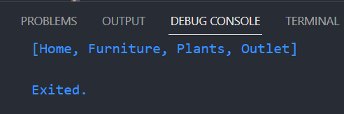

# **Laporan Praktikum**
# **Pertemuan 4**
### **Percabangan pada pemrograman DART, Perulangan pada pemrograman DART, Operasi Gi**
------


### **Data Mahasiswa**
><center></center>

><p>Nama : Lukas Valentino<p>
>NIM : 2141720032<p>
>Kelas : 3H<p>
>Prodi : D-IV Teknik Inormatika<p>
>Jurusan : Teknologi Inormasi<p>


<br>

### **Tujuan Praktikum**
Setelah menyelesaikan codelab ini Anda akan mampu untuk:

1. Menerapkan collections pada bahasa pemrograman Dart
2. Menerapkan records pada bahasa pemrograman Dart
3. Menerapkan functions pada bahasa pemrograman Dart

<br>

---------
<br>

### **Praktikum 1: Eksperimen Tipe Data List**
Selesaikan langkah-langkah praktikum berikut ini menggunakan VS Code atau Code Editor favorit Anda.

### **Langkah 1**
Ketik atau salin kode program berikut ke dalam fungsi main().

```dart
void main(){
    var list = [1, 2, 3];
    assert(list.length == 3);
    assert(list[1] == 2);
    print(list.length);
    print(list[1]);

    list[1] = 1;
    assert(list[1] == 1);
    print(list[1]);
}
```

### **Langkah 2**
Silakan coba eksekusi (Run) kode pada langkah 1 tersebut. Apa yang terjadi? Jelaskan!

**JAWAB**<p>
Dari hasil eksekusi pada langkah 1 diatas dihasilkan output seperti gambar dibawah ini<p>
<p>
Pada langkah pertama dari kode di atas, menginisialisasi sebuah list yang berisi tiga angka. Setelah itu, melakukan dua tindakan penting: pertama, memeriksa dan mencetak panjang list serta nilai dari elemen kedua dalam list tersebut. Kemudian, mengubah nilai elemen kedua dari list tersebut. Setelah perubahan dilakukan, memeriksa dan mencetak nilai elemen kedua yang telah diubah.<p>

### **Langkah 3**
Ubah kode pada langkah 1 menjadi variabel final yang mempunyai index = 5 dengan default value = null. Isilah nama dan NIM Anda pada elemen index ke-1 dan ke-2. Lalu print dan capture hasilnya.

Apa yang terjadi ? Jika terjadi error, silakan perbaiki.

**JAWAB**<p>

```dart
void main(){
  List<String?> finalList = List.filled(5, null);
  finalList[1] = "Lukas Valentino"; 
  finalList[2] = "2141720032";

  print(finalList.length);
  print(finalList[1]);
  print(finalList[2]); 
}
```
Dengan hasil output sebagai berikut <p>
<p>
Kode tersebut menginisialisasi sebuah list dengan nama "list" yang memiliki kapasitas untuk 5 elemen awalnya diisi dengan nilai null. Setelah itu, program mengubah nilai elemen pertama dari list dengan 'Lukas Valentino' dan nilai elemen kedua dengan '2141720032'.<p>


<br>

### **Praktikum 2: Eksperimen Tipe Data Set"**
Selesaikan langkah-langkah praktikum berikut ini menggunakan VS Code atau Code Editor favorit Anda.

### **Langkah 1**
Ketik atau salin kode program berikut ke dalam fungsi main().

```dart
void main(){
var halogens = {'fluorine', 'chlorine', 'bromine', 'iodine', 'astatine'};
print(halogens);
}
```

### **Langkah 2**
Silakan coba eksekusi (Run) kode pada langkah 1 tersebut. Apa yang terjadi? Jelaskan! Lalu perbaiki jika terjadi error.

**JAWAB**<p>
Dari hasil eksekusi pada langkah 1 diatas dihasilkan output seperti gambar dibawah ini<p>
<p>
Kode yang diberikan adalah kode untuk membuat sebuah Set dengan nama "halogens" yang berisi unsur-unsur halogen. Set adalah koleksi yang tidak memiliki indeks, dan unsur-unsur dalam Set tidak memiliki urutan tertentu. 

Setiap kali kode ini dijalankan, urutan elemen dalam Set mungkin berbeda-beda karena Set tidak mempertahankan urutan tertentu. Namun, semua elemen yang diberikan dalam Set akan ada dalam output.<p>

### **Langkah 3**
Tambahkan kode program berikut, lalu coba eksekusi (Run) kode Anda.

```dart
void main(){
    var names1 = <String>{};
    Set<String> names2 = {}; // This works, too.
    var names3 = {}; // Creates a map, not a set.

    print(names1);
    print(names2);
    print(names3);
}
```
Apa yang terjadi ? Jika terjadi error, silakan perbaiki namun tetap menggunakan ketiga variabel tersebut. Tambahkan elemen nama dan NIM Anda pada kedua variabel Set tersebut dengan dua fungsi berbeda yaitu .add() dan .addAll(). Untuk variabel Map dihapus, nanti kita coba di praktikum selanjutnya.

Dokumentasikan code dan hasil di console, lalu buat laporannya.

**JAWAB**<p>
Berikut adalah hasil output setelah menambahkan kode program diatas<p>
<p>
Kemudian saya menambahkan kode untuk menambahkan elemen nama dan NIM pada variabel Set: pada kode program diatas hingga menjadi sperti dibawah ini<p>

```dart
void main() {
    var names1 = <String>{};
    Set<String> names2 = {};

    names1.add("Lukas Valentino");
    names1.add("2141720032");

    names2.addAll({"Lukas Valentino", "2141720032"});

    print(names1);
    print(names2);
}
```
Dalam kode di atas, menggunakan .add() untuk menambahkan elemen satu per satu ke names1, dan .addAll() untuk menambahkan elemen dari sebuah Set ke names2. Hasilnya adalah:<p>
<p>

----
<br>

### **Praktikum 3: Eksperimen Tipe Data Maps"**
Selesaikan langkah-langkah praktikum berikut ini menggunakan VS Code atau Code Editor favorit Anda.

### **Langkah 1**
Ketik atau salin kode program berikut ke dalam fungsi main().

```dart
var gifts = {
  // Key:    Value
  'first': 'partridge',
  'second': 'turtledoves',
  'fifth': 1
};

var nobleGases = {
  2: 'helium',
  10: 'neon',
  18: 2,
};

print(gifts);
print(nobleGases);
```

### **Langkah 2**
Silakan coba eksekusi (Run) kode pada langkah 1 tersebut. Apa yang terjadi? Jelaskan! Lalu perbaiki jika terjadi error.

**JAWAB**<p>
Dari hasil eksekusi pada langkah 1 diatas dihasilkan output seperti gambar dibawah ini<p>
<p>
Variabel gifts menyimpan objek dengan tiga properti: first, second, dan fifth. Properti first memiliki nilai "partridge", properti second memiliki nilai "turtledoves", dan properti fifth memiliki nilai 1.
Variabel nobleGases menyimpan objek dengan tiga properti: 2, 10, dan 18. Properti 2 memiliki nilai "helium", properti 10 memiliki nilai "neon", dan properti 18 memiliki nilai 2.
</p>


### **Langkah 3**
Tambahkan kode program berikut, lalu coba eksekusi (Run) kode Anda.

```dart
var mhs1 = Map<String, String>();
gifts['first'] = 'partridge';
gifts['second'] = 'turtledoves';
gifts['fifth'] = 'golden rings';

var mhs2 = Map<int, String>();
nobleGases[2] = 'helium';
nobleGases[10] = 'neon';
nobleGases[18] = 'argon';
```

Apa yang terjadi ? Jika terjadi error, silakan perbaiki.

Tambahkan elemen nama dan NIM Anda pada tiap variabel di atas (gifts, nobleGases, mhs1, dan mhs2). Dokumentasikan hasilnya dan buat laporannya!

**JAWAB**<p>
Setelah penambahan kode program diatas dijalankan hasil outputnya masih sama seperti sebelumnya karena tidak ada kode yang mengubah outputnya, seperti berikut ini<p>
<p>
maka perlu menambahkan kode untuk elemen nama dan nim pada map seperti berikut ini

```dart
//praktikum 3
void main () {
    var gifts = {
    // Key:    Value
    'first': 'partridge',
    'second': 'turtledoves',
    'fifth': 1
  };

  var nobleGases = {
    2: 'helium',
    10: 'neon',
    18: 2,
  };

  var mhs1 = Map<String, String>();
  gifts['first'] = 'partridge';
  gifts['second'] = 'turtledoves';
  gifts['fifth'] = 'golden rings';

  var mhs2 = Map<int, String>();
  nobleGases[2] = 'helium';
  nobleGases[10] = 'neon';
  nobleGases[18] = 'argon';

  mhs1['nama'] = 'Lukas Valentino';
  mhs1['nim'] = '2141720032';

  mhs2[1] = 'Lukas Valentino';
  mhs2[2] = '2141720032';

  print(gifts);
  print(nobleGases);
  print(mhs1);
  print(mhs2);
}
```

dengan hasil output sebagai berikut<p>
<p>

----
<br>

### **Praktikum 4: Eksperimen Tipe Data List: Spread dan Control-flow Operators**
Selesaikan langkah-langkah praktikum berikut ini menggunakan VS Code atau Code Editor favorit Anda.

### **Langkah 1**
Ketik atau salin kode program berikut ke dalam fungsi main().

```dart
void main(){
var list = [1, 2, 3];
var list2 = [0, ...list];
print(list1);
print(list2);
print(list2.length);
}
```

### **Langkah 2**
Silakan coba eksekusi (Run) kode pada langkah 1 tersebut. Apa yang terjadi? Jelaskan! Lalu perbaiki jika terjadi error.

**JAWAB**<p>
Terjadi eror seperti gambar dibawah ini <p>
<p>
Terjadi error karena variabel list1 tidak didefinisikan. Kemudian saya mengubahnya menjadi list

```dart
void main() {
  var list1 = [1, 2, 3];
  var list2 = [0, ...list1];
  print(list1);
  print(list2);
  print(list2.length);
}
```
dan berikut hasil outputnya setelah diperbaiki<p>
 <p>


### **Langkah 3**
Tambahkan kode program berikut, lalu coba eksekusi (Run) kode Anda.

```dart
list1 = [1, 2, null];
print(list1);
var list3 = [0, ...?list1];
print(list3.length);
```

Apa yang terjadi ? Jika terjadi error, silakan perbaiki.

Tambahkan variabel list berisi NIM Anda menggunakan Spread Operators. Dokumentasikan hasilnya dan buat laporannya!

**JAWAB**<p>
Akan terjadi eror seperti gambar dibawah ini<p>
<p>
Maka kemudian saya memperbaiki kode program menjadi seperti dibawah ini

```dart
void main(){
    List<int?> list = [1, 2, 3];
    var list2 = [0, ...list];
    print(list);
    print(list2);
    print(list2.length);

    list = [1, 2, null];
    print(list);
    var list3 = [0, ...list];
    print(list3.length);
}
```
Dan eror pun sudah tidak ada dan menghasilkan output seperti gambar dibawah ini<p>
<p>
kemudian saya menambahkan variabel list berisi NIM Anda menggunakan Spread Operators sesuai intruksi menjadi seperti dibawah ini

```dart
void main(){
    List<int?> list = [1, 2, 3];
    var list2 = [0, ...list];
    print(list);
    print(list2);
    print(list2.length);

    list = [1, 2, null];
    print(list);
    var list3 = [0, ...list];
    print(list3.length);

    var nimA = [2, 1, 4, 1, 7];
    var nimB = [2, 0, 0, 3, 2];
    var list4 = [...nimA, ...nimB];
    print(list4);
    print(list4.length);
}
```
Dan Hasil outputnya adalah sebagai berikut<p>
<p>


### **Langkah 4**
Tambahkan kode program berikut, lalu coba eksekusi (Run) kode Anda.

```dart
var nav = ['Home', 'Furniture', 'Plants', if (promoActive) 'Outlet'];
print(nav);
```

Apa yang terjadi ? Jika terjadi error, silakan perbaiki. Tunjukkan hasilnya jika variabel promoActive ketika true dan false.

**JAWAB**<p>
Hasilnya adalah terjadi eror seperti berikut <p>
<p>
hal ini terjadi error karena variable promoActive tidak didefinisikan. Kemudian saya mengubahnya menjadi seperti berikut:

```dart
void main(){
    var promoActive = true;
    var nav = ['Home', 'Furniture', 'Plants', if (promoActive) 'Outlet'];
    print(nav);
}
```
Maka akan menghasilkan output seperti berikut <p>
promoActive = true <p>
<p>
promoActive = false <p>
<p>

### **Langkah 5**
Tambahkan kode program berikut, lalu coba eksekusi (Run) kode Anda.

```dart
void main(){
var nav2 = ['Home', 'Furniture', 'Plants', if (login case 'Manager') 'Inventory'];
print(nav2);
}
```

Apa yang terjadi ? Jika terjadi error, silakan perbaiki. Tunjukkan hasilnya jika variabel login mempunyai kondisi lain.

**JAWAB**<p>
terjadi eror seperti gambar dibawah<p>
<p>
hal tersebut terjadi karena variable login tidak didefinisikan.

```dart
void main(){
    String login = 'Manager';

    var nav2 = ['Home','Furniture','Plants',if (login case 'Manager') 'Inventory'];
    print(nav2);
}
```
maka hasil outputnya akan menjadi seperti berikut <p>
Ketika dijalankan dengan login = 'Manager'<p>
<p>
Ketika dijalankan dengan login = 'User'<p>
<p>

### **Langkah 6**
Tambahkan kode program berikut, lalu coba eksekusi (Run) kode Anda.

```dart
var listOfInts = [1, 2, 3];
var listOfStrings = ['#0', for (var i in listOfInts) '#$i'];
assert(listOfStrings[1] == '#1');
print(listOfStrings);
```
Apa yang terjadi ? Jika terjadi error, silakan perbaiki. Jelaskan manfaat Collection For dan dokumentasikan hasilnya.

**JAWAB**<p>
Kode program diatas menghasilkan output seperti berikut<p>

<p>
Dalam contoh kode Dart tersebut, ekspresi "collection for" digunakan untuk membuat daftar listOfStrings dengan mengiterasi melalui elemen-elemen dalam listOfInts dan menggabungkannya dengan tanda pagar (#). Hasilnya adalah listOfStrings yang berisi ['#1', '#2', '#3']. Selanjutnya, kode memeriksa apakah elemen kedua dalam listOfStrings adalah '#2' menggunakan pernyataan assert. Terakhir, isi dari listOfStrings dicetak ke konsol.</p>

------
<br>

## **Praktikum 5: Eksperimen Tipe Data Records**

>Catatan: Tipe data Records mulai diperkenalkan pada Dart versi 3.0. Pastikan Anda sudah setup menggunakan Dart 3.0 atau yang lebih baru.

Selesaikan langkah-langkah praktikum berikut ini menggunakan VS Code atau Code Editor favorit Anda.

### **Langkah 1**
Ketik atau salin kode program berikut ke dalam fungsi main().

```dart
var record = ('first', a: 2, b: true, 'last');
print(record)
```

### **Langkah 2**
Silakan coba eksekusi (Run) kode pada langkah 1 tersebut. Apa yang terjadi? Jelaskan! Lalu perbaiki jika terjadi error.

**JAWAB**<p>
Terjadi eror karena tidak adanya titik koma.  <p>
<p>
<p>Kemudian saya memperbaiki kode tersebut.
</p>


### **Langkah 3**
Tambahkan kode program berikut di luar scope void main(), lalu coba eksekusi (Run) kode Anda.

```dart
(int, int) tukar((int, int) record) {
  var (a, b) = record;
  return (b, a);
}
```

Apa yang terjadi ? Jika terjadi error, silakan perbaiki. Gunakan fungsi tukar() di dalam main() sehingga tampak jelas proses pertukaran value field di dalam Records.

**JAWAB**<p>
berikut setelah saya tambahkan kode diatas

```dart
(int, int) tukar((int, int) record) {
  var (a, b) = record;
  return (b, a);
}

void main() {
  var record = (1, 2);
  print(record);
  print(tukar(record));
}
```
berikut adalah hasil output setelah saya menabahkan kode diatas dan menghasilkan output seperti berikut<p>
<p>

### **Langkah 4**
Tambahkan kode program berikut di dalam scope void main(), lalu coba eksekusi (Run) kode Anda.

```dart
// Record type annotation in a variable declaration:
(String, int) mahasiswa;
print(mahasiswa);
```

Apa yang terjadi ? Jika terjadi error, silakan perbaiki. Inisialisasi field nama dan NIM Anda pada variabel record mahasiswa di atas. Dokumentasikan hasilnya dan buat laporannya!

**JAWAB**<p>
Terjadi error seperti berikut.<p>

<p>
Pada kode diatas terjadi error dikarenakan nilainya belum dinisialisasi.
</p>

```dart
void main() {
  (String, int) mahasiswa = ('Lukas Valentino', 2141720032);
  print(mahasiswa);
}
```
maka didapati hasil output seperti berikut <p>
<p>

### **Langkah 5**
Tambahkan kode program berikut di dalam scope void main(), lalu coba eksekusi (Run) kode Anda.

```dart
var mahasiswa2 = ('first', a: 2, b: true, 'last');

print(mahasiswa2.$1); // Prints 'first'
print(mahasiswa2.a); // Prints 2
print(mahasiswa2.b); // Prints true
print(mahasiswa2.$2); // Prints 'last'
```

Apa yang terjadi ? Jika terjadi error, silakan perbaiki. Gantilah salah satu isi record dengan nama dan NIM Anda, lalu dokumentasikan hasilnya dan buat laporannya!

**JAWAB**<p>
Kemudian men <p>
<p>
kemudian saya melakukan modifikasi kode program dengan mengganti salah satu isi record dengan nama dan Nim saya menjadi seperti dibawah ini

```dart
void main() {
  var mahasiswa2 = ('Lukas Valentino', a: 2141720022, b: true, 'last');

  print(mahasiswa2.$1);
  print(mahasiswa2.a);
  print(mahasiswa2.b);
  print(mahasiswa2.$2);
}
```
Dan menghasilkan output seperti gambar dibawah ini <p>
<p>


------
<br>

### **Tugas Praktikum**
1. Silakan selesaikan Praktikum 1 sampai 5, lalu dokumentasikan berupa screenshot hasil pekerjaan Anda beserta penjelasannya!<p>

    >**Jawab**<p>
    > Sudah saya jawab dan jelaskan pada praktikum 1, 2, 3, 4 dan 5 tadi diatas atau juga bisa mengklik link dibawah kemudia diarahkan keatas secara otomatis
    >- [Praktikum 1 (klik)](#praktikum-1-eksperimen-tipe-data-list)
    >- [Praktikum 2 (klik)](#praktikum-2-eksperimen-tipe-data-set)
    >- [Praktikum 3 (klik)](#praktikum-3-eksperimen-tipe-data-maps)
    >- [Praktikum 4 (klik)](#praktikum-4-eksperimen-tipe-data-list-spread-dan-control-flow-operators)
    >- [Praktikum 5 (klik)](#praktikum-5-eksperimen-tipe-data-records)<p>
    > 
<p>

## Tugas Praktikum

1. Silakan selesaikan Praktikum 1 sampai 5, lalu dokumentasikan berupa screenshot hasil pekerjaan Anda beserta penjelasannya!
   - done
2. Jelaskan yang dimaksud Functions dalam bahasa Dart!
   - Functions adalah sebuah blok kode yang dapat digunakan kembali. Sebuah fungsi dapat memiliki parameter atau tidak. Fungsi dapat mengembalikan nilai atau tidak. Fungsi dapat memiliki tipe kembalian atau tidak.
3. Jelaskan jenis-jenis parameter di Functions beserta contoh sintaksnya!
   - Named Parameter, Named parameter adalah parameter yang diberi nama. Named parameter dapat diberikan nilai default. Named parameter dapat diberikan nilai default dengan menggunakan `=`.
     - Required Named Parameter adalah named parameter yang tidak diberi nilai default.
         - Contoh kode:
           ```dart
           void main() {
             void greet(String name) {
              print('Hello, $name!');
              }
              greet('Alice');  
             }
           ```
           - Output:
             ```dart
             Hello, Alice!
             ```
      - Optional Named Parameter
        - Optional named parameter adalah named parameter yang diberi nilai default.
          - Penulisan:
            ```dart
            void main() {
              void greet({String name = 'World'}) {
                print('Hello, $name!');
                }
                // Memanggil fungsi greet dengan parameter opsional
                greet(name: 'Bob'); // Output: Hello, Bob!
                greet(); // Output: Hello, World!

            }
            ```
            - Output:
              ```dart
              Hello, Bob!
              Hello, World!
              ```
    - Positional Parameter
      - Required Positional Parameter
        - Required positional parameter adalah positional parameter yang tidak diberi nilai default.
          - Penulisan:
            ```dart
            void main() {
              String say(String from, String msg) {
                var result = '$from says $msg';
                return result;
              }
            }
            ```
            - Pemanggilan:
              ```dart
              say('Bob', 'Howdy');
              ```
      - Optional Positional Parameter
        - Optional positional parameter adalah positional parameter yang diberi nilai default.
          - Penulisan:
            ```dart
            void main() {
              String say(String from, String msg, [String? device]) {
                var result = '$from says $msg';
                if (device != null) {
                  result = '$result with a $device';
                }
                return result;
              }
            }
            ```
            - Pemanggilan:
              ```dart
              say('Bob', 'Howdy');
              say('Bob', 'Howdy', 'smoke signal');
              ```

4. Jelaskan maksud Functions sebagai first-class objects beserta contoh sintaknya!
   - Fungsi yang dianggap sebagai objek first-class dapat disimpan dalam variabel, digunakan sebagai argumen saat memanggil fungsi lain, dan bahkan dikembalikan sebagai hasil dari fungsi lainnya.
   - Contoh:
     ```dart
     void main() {
       var say = (String from, String msg, [String? device]) {
         var result = '$from says $msg';
         if (device != null) {
           result = '$result with a $device';
         }
         return result;
       };

       print(say('Bob', 'Howdy'));
       print(say('Bob', 'Howdy', 'smoke signal'));
     }
     ```

5. Apa itu Anonymous Functions? Jelaskan dan berikan contohnya!
   - Fungsi anonim adalah jenis fungsi yang tidak memiliki nama. Fungsi anonim dapat disimpan dalam variabel, digunakan sebagai argumen saat memanggil fungsi lain, dan bahkan dikembalikan sebagai hasil dari fungsi lainnya.
   - Contoh:
     ```dart
     void main() {
       var list = ['apples', 'bananas', 'oranges'];
       list.forEach((item) {
         print('${list.indexOf(item)}: $item');
       });
     }
     ```

6. Jelaskan perbedaan Lexical scope dan Lexical closures! Berikan contohnya!
   - Lexical scope adalah konsep dalam pemrograman yang mengatur bagaimana variabel dapat diakses dalam kode, dengan dasar pada struktur kode dan kurung kurawal. Ini berarti variabel hanya dapat diakses dalam cakupan di mana mereka didefinisikan, dari level terdalam hingga level tertinggi dalam struktur kode.
   
   - Sementara itu, lexical closure adalah kemampuan fungsi untuk tetap memiliki akses ke variabel-variabel dari cakupannya, bahkan ketika fungsi tersebut digunakan di luar cakupan asalnya. Ini berarti fungsi dapat "menangkap" variabel-variabel dari sekitarnya dan menggunakannya ketika dipanggil di tempat lain dalam kode. Jadi, lexical closure adalah tentang kemampuan fungsi untuk menjaga hubungan dengan variabel-variabel dari lingkungan di mana mereka dibuat, bahkan saat digunakan di lokasi yang berbeda.

7. Jelaskan dengan contoh cara membuat return multiple value di Functions!
   - Untuk membuat return multiple value di Functions, kita dapat menggunakan `Record`.
   - Contoh:
     ```dart
      (String, int) getData() {
        return ('Lukas Valentino', 2141720032);
      }

     void main() {
       var (nama, nim) = getData();

       print(nama);
       print(nim);
     }
     ```
