# **Laporan Praktikum**
# **Pertemuan 5**
### **Flutter Fundamental Bagian 1**
------


### **Data Mahasiswa**


><p>Nama : Lukas Valentino<p>
>NIM : 2141720032<p>
>Kelas : 3H<p>
>Prodi : D-IV Teknik Inormatika<p>
>Jurusan : Teknologi Inormasi<p>


<br>

### **Tujuan Praktikum**
Setelah menyelesaikan codelab ini Anda akan mampu untuk:

1. Menjelaskan bagian-bagian dari project file flutter. 
2. Menggunakan fitur hot reload dan restart. 
3. Menjelaskan perbedaan stateful dan stateless widget. 
4. Menerapkan widget-widget dasar flutter dan tema. 

<br>

---------
<br>

### **Praktikum 1: Membuat Project Flutter Baru**
Selesaikan langkah-langkah praktikum berikut ini menggunakan VS Code atau Code Editor favorit Anda.

>**Perhatian:**<p> Diasumsikan Anda telah berhasil melakukan setup environment Flutter SDK, VS Code, Flutter Plugin, dan Android/iOS SDK pada Codelabs#1.

### **Langkah 1**
Buka VS Code, lalu tekan tombol Ctrl + Shift + P maka akan tampil Command Palette, lalu ketik Flutter. Pilih New Application Project.

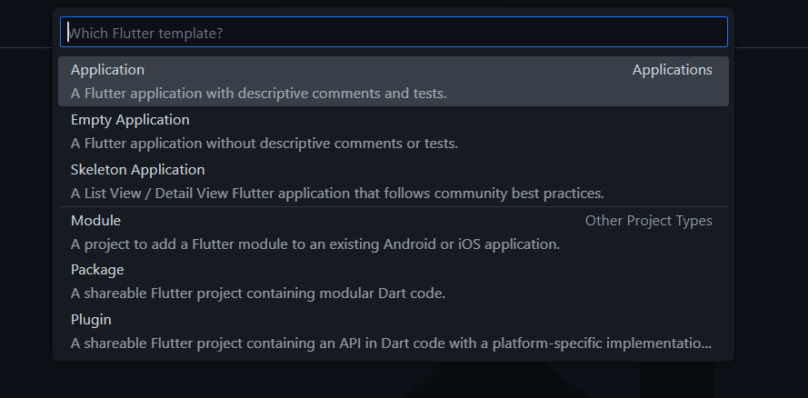<p>


>**Catatan:**<p> Anda dapat mengakses Command Palette dengan cara lain, yaitu pilih menu View > Command Palette. Tombol shortcut Ctrl + Shift + P mungkin hanya berlaku di Windows.

### **Langkah 2**
Kemudian buat folder sesuai style laporan praktikum yang Anda pilih. Disarankan pada folder dokumen atau desktop atau alamat folder lain yang tidak terlalu dalam atau panjang. Lalu pilih Select a folder to create the project in.<p>

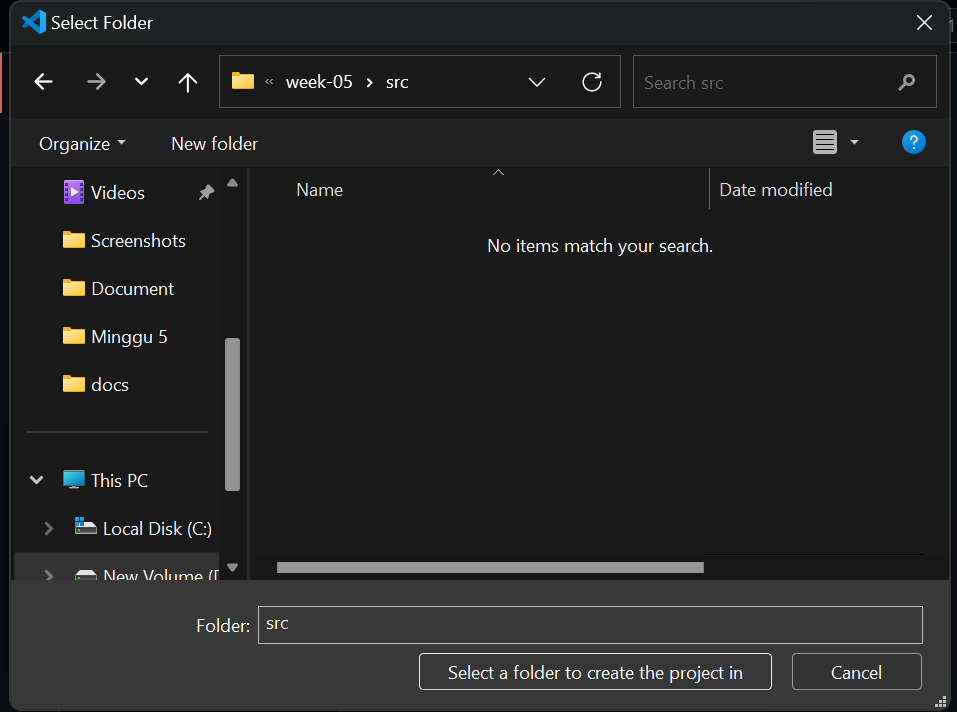<p>

### **Langkah 3**
Buat nama project flutter hello_world seperti berikut, lalu tekan Enter. Tunggu hingga proses pembuatan project baru selesai.

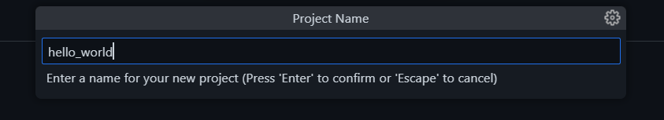<p>

>**Perhatian:**<p> Nama project ini harus lowercase (huruf kecil semua) tanpa menggunakan spasi. Untuk memisahkan kata, bisa menggunakan underline (garis bawah). Nama project tidak dapat diawali dengan angka atau karakter khusus lain. Nama project ini bukan nama aplikasi yang akan tampil di Play Store atau App Store. Untuk nama aplikasi, nanti dapat diatur ketika melakukan deployment.

### **Langkah 4**
Jika sudah selesai proses pembuatan project baru, pastikan tampilan seperti berikut. Pesan akan tampil berupa "Your Flutter Project is ready!" artinya Anda telah berhasil membuat project Flutter baru.

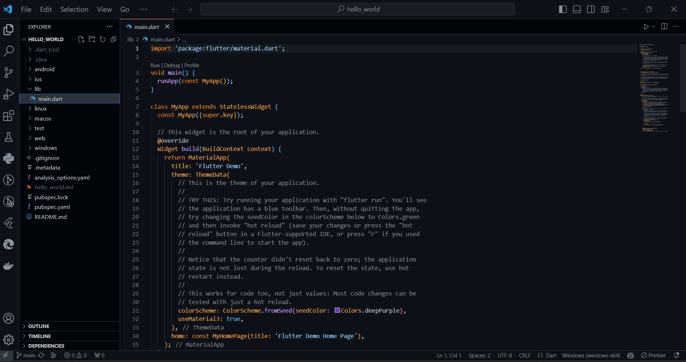<p

-----
<br>

### **Praktikum 2: Membuat Repository GitHub dan Laporan Praktikum"**
Melanjutkan dari praktikum 1, silakan selesaikan langkah-langkah berikut ini.

>**Perhatian:** <p>Diasumsikan Anda telah mempunyai akun GitHub dan Anda telah memahami konsep dasar dalam bekerja menggunakan Git pada pertemuan pertama.<p>Praktikum ini dapat Anda lewati langsung ke langkah 11 jika sudah paham cara membuat laporan praktikum sesuai style yang Anda pilih.

### **Langkah 1 - 10**
Saya sebelumnya sudah membuat repository untuk mata kuliah Pemrograman Mobile.


### **Langkah 11**
Kembali ke VS Code, ubah platform di pojok kanan bawah ke emulator atau device atau bisa juga menggunakan browser Chrome. Lalu coba running project hello_world dengan tekan F5 atau Run > Start Debugging. Tunggu proses kompilasi hingga selesai, maka aplikasi flutter pertama Anda akan tampil seperti berikut.

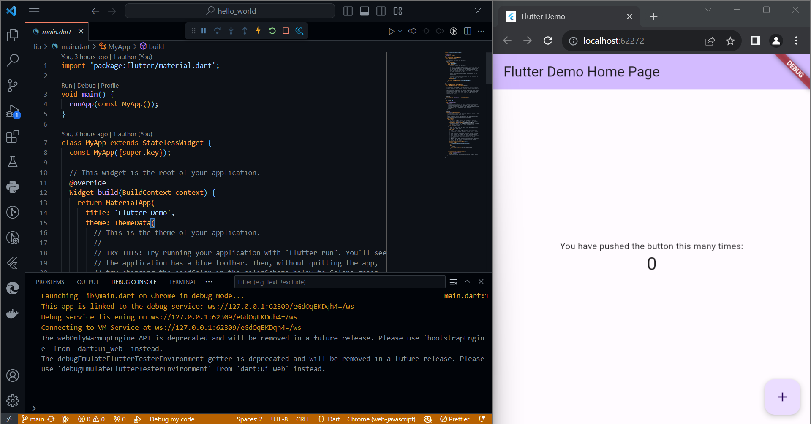<p>

>**Perhatian:** <p> Proses Run atau kompilasi untuk pertama kali akan memakan waktu cukup lama (3-5 menit). Namun, proses kompilasi berikutnya menjadi lebih cepat. Berbeda ketika melakukan kompilasi ke device, hal ini akan memakan waktu lebih lama lagi.

### **Langkah 12**
Silakan screenshot seperti pada Langkah 11, namun teks yang ditampilkan dalam aplikasi berupa nama lengkap Anda. Simpan file screenshot dengan nama 01.png pada folder images (buat folder baru jika belum ada) di project hello_world Anda. Lalu ubah isi README.md seperti berikut, sehingga tampil hasil screenshot pada file README.md. Kemudian push ke repository Anda.

<p>

>**Perhatian:**<p> Lakukan proses screenshot seperti pada Langkah 12 untuk setiap Laporan Praktikum yang Anda akan buat pada praktikum selanjutnya hingga pertemuan project final.

----
<br>

### **Praktikum 3: Menerapkan Widget Dasar"**
Selesaikan langkah-langkah praktikum berikut ini dengan melanjutkan dari praktikum sebelumnya.

### **Langkah 1 Text Widget**
Buat folder baru basic_widgets di dalam folder lib. Kemudian buat file baru di dalam basic_widgets dengan nama text_widget.dart. Ketik atau salin kode program berikut ke project hello_world Anda pada file text_widget.dart.

```dart
import 'package:flutter/material.dart';

class MyTextWidget extends StatelessWidget {
  const MyTextWidget({Key? key}) : super(key: key);

  @override
  Widget build(BuildContext context) {
    return const Text(
      "Nama saya Lukas Valentino, sedang belajar Pemrograman Mobile",
      style: TextStyle(color: Colors.red, fontSize: 14),
      textAlign: TextAlign.center);
  }
}
```
>**Perhatian:**<p> Gantilah teks Fulan dengan nama lengkap Lukas Valentino.

Lakukan import file text_widget.dart ke main.dart, lalu ganti bagian text widget dengan kode di atas. Maka hasilnya seperti gambar berikut. Screenshot hasil milik Anda, lalu dibuat laporan pada file README.md.

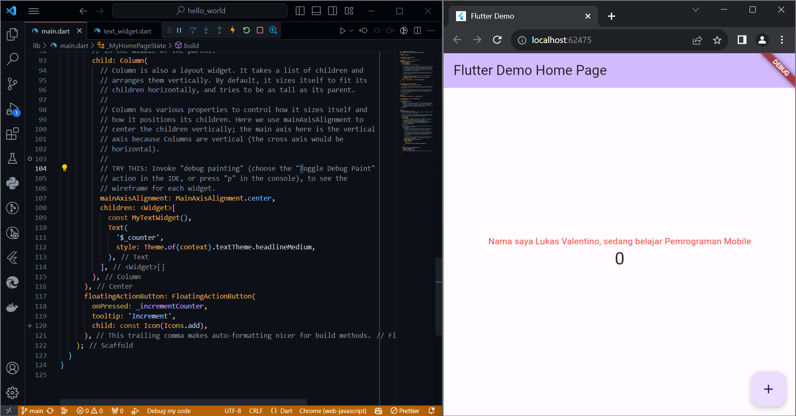<p>

### **Langkah 2 Image Widget**
Buat sebuah file image_widget.dart di dalam folder basic_widgets dengan isi kode berikut.

```dart
import 'package:flutter/material.dart';

class MyImageWidget extends StatelessWidget {
  const MyImageWidget({Key? key}) : super(key: key);

  @override
  Widget build(BuildContext context) {
    return const Image(
      image: AssetImage("logo_polinema.jpg")
    );
  }
}
```
Lakukan penyesuaian asset pada file pubspec.yaml dan tambahkan file logo Anda di folder assets project hello_world.

```dart
flutter:
  assets:
     - logo_polinema.jpg
```
menjadi seperti berikut<p>
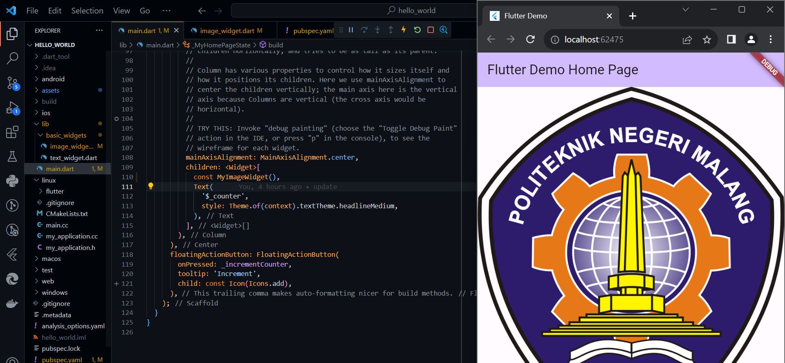<p>
Jangan lupa sesuaikan kode dan import di file main.dart kemudian akan tampil gambar seperti berikut.
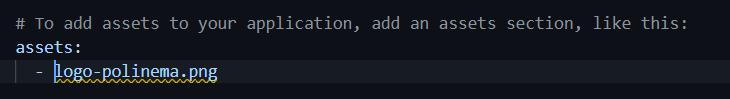<p>

----
<br>

### **Praktikum 4: Menerapkan Widget Material Design dan iOS Cupertino**
Selesaikan langkah-langkah praktikum berikut ini dengan melanjutkan project hello_world Anda. Lakukan langkah yang sama seperti pada Praktikum 3, yaitu setiap widget dibuat file sendiri lalu import ke main.dart dan screenshot hasilnya.

### **Langkah 1 Cupertino Button dan Loading Bar**
Buat file di basic_widgets > loading_cupertino.dart. Import stateless widget dari material dan cupertino. Lalu isi kode di dalam method Widget build adalah sebagai berikut.

```dart
return MaterialApp(
      home: Container(
        margin: const EdgeInsets.only(top: 30),
        color: Colors.white,
        child: Column(
          children: <Widget>[
            CupertinoButton(
              child: const Text("Contoh button"),
              onPressed: () {},
            ),
            const CupertinoActivityIndicator(),
          ],
        ),
      ),
    );
```

### **Langkah 2 Floating Action Button (FAB)**
Button widget terdapat beberapa macam pada flutter yaitu ButtonBar, DropdownButton, TextButton, FloatingActionButton, IconButton, OutlineButton, PopupMenuButton, dan ElevatedButton.<p>

Buat file di basic_widgets > fab_widget.dart. Import stateless widget dari material. Lalu isi kode di dalam method Widget build adalah sebagai berikut.

```dart
return MaterialApp(
      home: Scaffold(
        floatingActionButton: FloatingActionButton(
          onPressed: () {
            // Add your onPressed code here!
          },
          child: const Icon(Icons.thumb_up),
          backgroundColor: Colors.pink,
        ),
      ),
    );
```

### **Langkah 3 Scaffold Widget**
Scaffold widget digunakan untuk mengatur tata letak sesuai dengan material design.<p>Ubah isi kode main.dart seperti berikut.

```dart
import 'package:flutter/material.dart';

void main() {
  runApp(const MyApp());
}

class MyApp extends StatelessWidget {
  const MyApp({Key? key}) : super(key: key);

  // This widget is the root of your application.
  @override
  Widget build(BuildContext context) {
    return MaterialApp(
      title: 'Flutter Demo',
      theme: ThemeData(
        primarySwatch: Colors.red,
      ),
      home: const MyHomePage(title: 'My Increment App'),
    );
  }
}

class MyHomePage extends StatefulWidget {
  const MyHomePage({Key? key, required this.title}) : super(key: key);

  final String title;

  @override
  State<MyHomePage> createState() => _MyHomePageState();
}

class _MyHomePageState extends State<MyHomePage> {
  int _counter = 0;

  void _incrementCounter() {
    setState(() {
      _counter++;
    });
  }

  @override
  Widget build(BuildContext context) {
    return Scaffold(
      appBar: AppBar(
        title: Text(widget.title),
      ),
      body: Center(
        child: Column(
          mainAxisAlignment: MainAxisAlignment.center,
          children: <Widget>[
            const Text(
              'You have pushed the button this many times:',
            ),
            Text(
              '$_counter',
              style: Theme.of(context).textTheme.headline4,
            ),
          ],
        ),
      ),
      bottomNavigationBar: BottomAppBar(
        child: Container(
          height: 50.0,
        ),
      ),
      floatingActionButton: FloatingActionButton(
        onPressed: _incrementCounter,
        tooltip: 'Increment Counter',
        child: const Icon(Icons.add),
      ), 
      floatingActionButtonLocation: FloatingActionButtonLocation.centerDocked,
    );
  }
}
```
dan berikut adalah hasil modifikasi kode main.dart diatas<p>
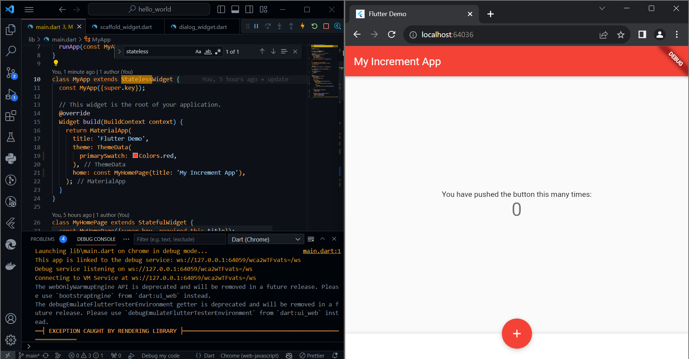<p>
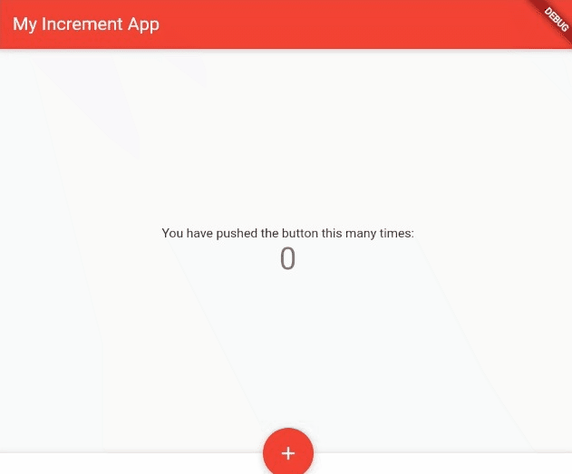<p>
<br>
Berikut adalah tampilan mobile.
<br>
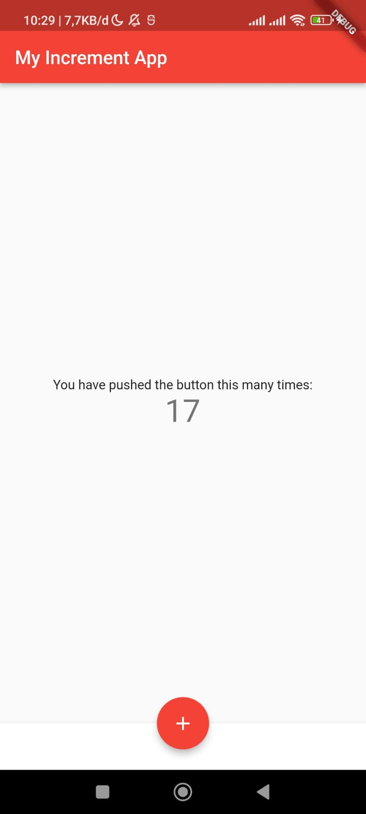

### **Langkah 4 Dialog Widget**
Dialog widget pada flutter memiliki dua jenis dialog yaitu AlertDialog dan SimpleDialog.<p>Ubah isi kode main.dart seperti berikut.

```dart
class MyApp extends StatelessWidget {
  const MyApp({Key? key}) : super(key: key);

  @override
  Widget build(BuildContext context) {
    return const MaterialApp(
      home: Scaffold(
        body: MyLayout(),
      ),
    );
  }
}

class MyLayout extends StatelessWidget {
  const MyLayout({Key? key}) : super(key: key);

  @override
  Widget build(BuildContext context) {
    return Padding(
      padding: const EdgeInsets.all(8.0),
      child: ElevatedButton(
        child: const Text('Show alert'),
        onPressed: () {
          showAlertDialog(context);
        },
      ),
    );
  }
}

showAlertDialog(BuildContext context) {
  // set up the button
  Widget okButton = TextButton(
    child: const Text("OK"),
    onPressed: () {
      Navigator.pop(context);
    },
  );

  // set up the AlertDialog
  AlertDialog alert = AlertDialog(
    title: const Text("My title"),
    content: const Text("This is my message."),
    actions: [
      okButton,
    ],
  );

  // show the dialog
  showDialog(
    context: context,
    builder: (BuildContext context) {
      return alert;
    },
  );
}
```
dan berikut adalah hasil modifikasi kode main.dart diatas<p>
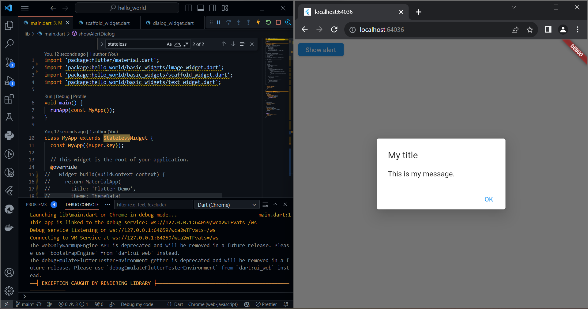<p>
<br>
Tampilan pada mobile.
<br>
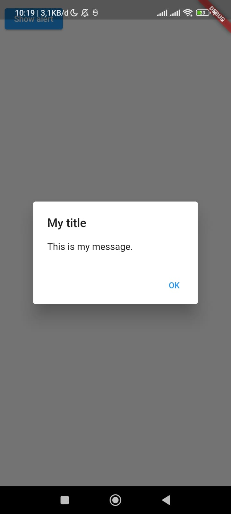<p>

### **Langkah 5 Input dan Selection Widget**
Flutter menyediakan widget yang dapat menerima input dari pengguna aplikasi yaitu antara lain Checkbox, Date and Time Pickers, Radio Button, Slider, Switch, TextField.<p>. Contoh penggunaan TextField widget adalah sebagai berikut:

```dart
class MyApp extends StatelessWidget {
  const MyApp({Key? key}) : super(key: key);

  @override
  Widget build(BuildContext context) {
    return MaterialApp(
      home: Scaffold(
        appBar: AppBar(title: const Text("Contoh TextField")),
        body: const TextField(
          obscureText: false,
          decoration: InputDecoration(
            border: OutlineInputBorder(),
            labelText: 'Nama',
          ),
        ),
      ),
    );
  }
}
```
dan berikut adalah hasil modifikasi kode main.dart diatas<p>
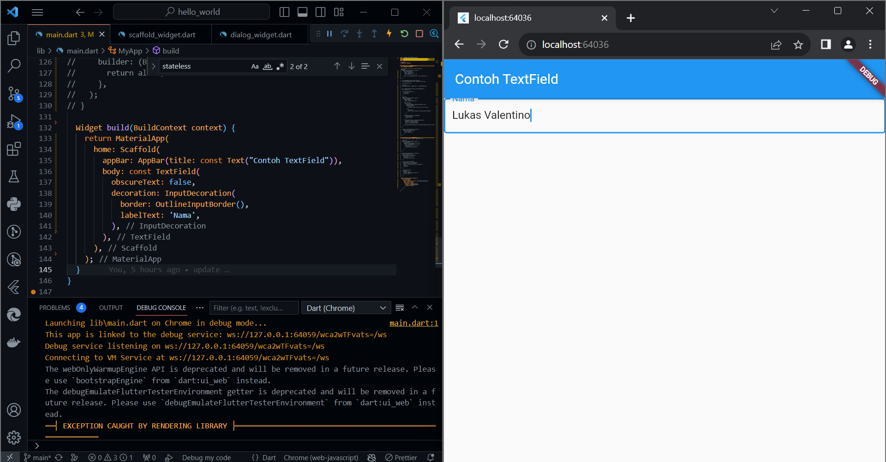<p>

Berikut adalah tampilan mobile.
<br>
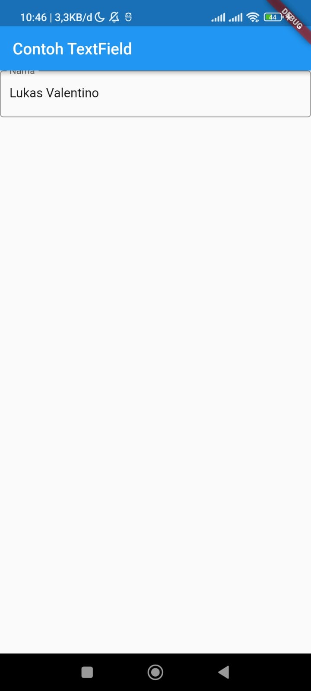

### **Langkah 6 Date and Time Pickers**
Date and Time Pickers termasuk pada kategori input dan selection widget, berikut adalah contoh penggunaan Date and Time Pickers.

```dart
import 'dart:async';
import 'package:flutter/material.dart';

void main() => runApp(const MyApp());

class MyApp extends StatelessWidget {
  const MyApp({Key? key}) : super(key: key);

  @override
  Widget build(BuildContext context) {
    return const MaterialApp(
      title: 'Contoh Date Picker',
      home: MyHomePage(title: 'Contoh Date Picker'),
    );
  }
}

class MyHomePage extends StatefulWidget {
  const MyHomePage({Key? key, required this.title}) : super(key: key);

  final String title;

  @override
  _MyHomePageState createState() => _MyHomePageState();
}

class _MyHomePageState extends State<MyHomePage> {
  // Variable/State untuk mengambil tanggal
  DateTime selectedDate = DateTime.now();

  //  Initial SelectDate FLutter
  Future<void> _selectDate(BuildContext context) async {
    // Initial DateTime FIinal Picked
    final DateTime? picked = await showDatePicker(
        context: context,
        initialDate: selectedDate,
        firstDate: DateTime(2015, 8),
        lastDate: DateTime(2101));
    if (picked != null && picked != selectedDate) {
      setState(() {
        selectedDate = picked;
      });
    }
  }

  @override
  Widget build(BuildContext context) {
    return Scaffold(
      appBar: AppBar(
        title: Text(widget.title),
      ),
      body: Center(
        child: Column(
          mainAxisSize: MainAxisSize.min,
          children: <Widget>[
            Text("${selectedDate.toLocal()}".split(' ')[0]),
            const SizedBox(
              height: 20.0,
            ),
            ElevatedButton(
              onPressed: () => {
                _selectDate(context),
                // ignore: avoid_print
                print(selectedDate.day + selectedDate.month + selectedDate.year)
              },
              child: const Text('Pilih Tanggal'),
            ),
          ],
        ),
      ),
    );
  }
}
```
dan berikut adalah hasil modifikasi kode main.dart diatas<p>
<p>

<br>
Berikut ini adalah tampilan mobile.
<br>
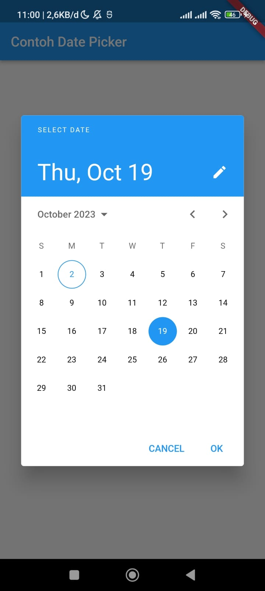

------
<br>

### **Tugas Praktikum**
1. Selesaikan Praktikum 1 sampai 4, lalu dokumentasikan dan push ke repository Anda berupa screenshot setiap hasil pekerjaan beserta penjelasannya di file README.md!<p>

    >**Jawab**<p>
    > Sudah saya jawab dan jelaskan pada praktikum 1, 2, 3 dan 4 tadi diatas atau juga bisa mengklik link dibawah kemudia diarahkan keatas secara otomatis
    >- [Praktikum 1 (klik)](#praktikum-1-membuat-project-flutter-baru)
    >- [Praktikum 2 (klik)](#praktikum-2-membuat-repository-github-dan-laporan-praktikum)
    >- [Praktikum 3 (klik)](#praktikum-3-menerapkan-widget-dasar)
    >- [Praktikum 4 (klik)](#praktikum-4-menerapkan-widget-material-design-dan-ios-cupertino)
    > 
<p>

2. Pada praktikum 4 mulai dari Langkah 3 sampai 6, buatlah file widget tersendiri di folder basic_widgets, kemudian pada file main.dart cukup melakukan import widget sesuai masing-masing langkah tersebut!<p>

    >**Jawab**<p>
    >pada praktikum ini saya membuat file widget tersendiri sesuai intruksi seperti berikut<p>
    >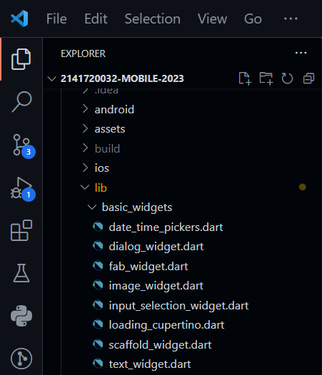<p><p>
    >kemudian saya melakukan modifikasi pada main dart seperti berikut

    ```dart
    import 'package:flutter/material.dart';
    import 'package:hello_world/basic_widgets/date_time_pickers.dart';
    import 'package:hello_world/basic_widgets/dialog_widget.dart';
    // import 'package:hello_world/basic_widgets/image_widget.dart';
    import 'package:hello_world/basic_widgets/input_selection_widget.dart';
    import 'package:hello_world/basic_widgets/scaffold_widget.dart';
    // import 'package:hello_world/basic_widgets/text_widget.dart';
    void main() {
      runApp(const TugasNo2());
    }

    class TugasNo2 extends StatelessWidget {
      const TugasNo2({super.key});

      @override
      Widget build(BuildContext context) {
        return const MaterialApp(
          home: Row(
            children: [
              Expanded(child: MyScaffoldWidget()),
              Expanded(child: MyDialogWidget()),
              Expanded(child: MyInputSelectionWidget()),
              Expanded(child: MyDateTimePickers()),
            ],
          ),
        );
      }
    }
    ```
    >kemudian menghasilkan output seperti berikut<p>
    >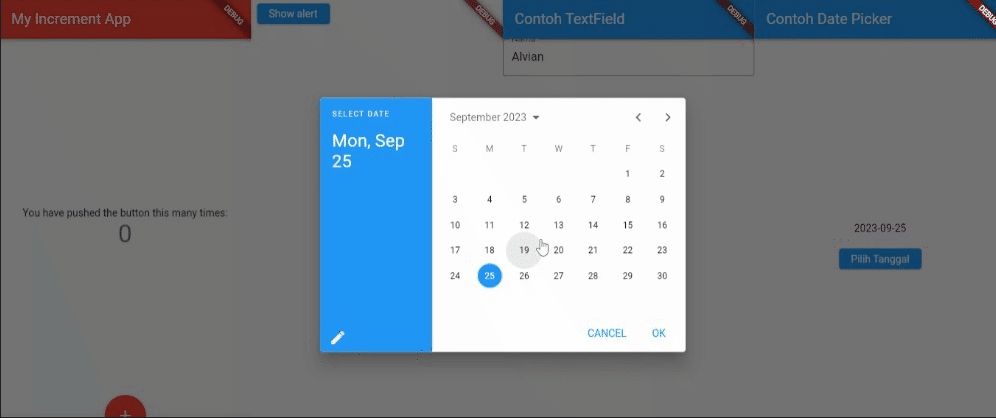<p><p>

3. Selesaikan Codelabs: Your first Flutter app, lalu buatlah laporan praktikumnya dan push ke repository GitHub Anda!<p>

    >**Jawab**<p>
    >Saya telah menyeleasikan tantangan tersebut dan saya simpan pada repositori saya berikut :<p>
    >- [Repository codelabs : Your Firs Flutter app (klik)](/week-05/src/namer_app/)
    >kemudian codelab tersebut menghasilkan output seperti berikut<p>
    >><p>
    

4. README.md berisi: capture hasil akhir tiap praktikum (side-by-side, bisa juga berupa file GIF agar terlihat proses perubahan ketika ada aksi dari pengguna) di browser dan perangkat fisik (device) dengan menampilkan NIM dan Nama Anda sebagai ciri pekerjaan Anda. Jika mode developer di perangkat HP Anda belum aktif, silakan cari di internet cara mengaktifkannya!<p>

    >**Jawab**<p>
    > Sudah saya jawab dan jelaskan pada praktikum 1, 2, 3 dan 4 tadi diatas, beserta hasil output berupa gambar bergerak gif silahkan klik link dibawah kemudia diarahkan keatas secara otomatis
    >- [Praktikum 1 (klik)](#praktikum-1-membuat-project-flutter-baru)
    >- [Praktikum 2 (klik)](#praktikum-2-membuat-repository-github-dan-laporan-praktikum)
    >- [Praktikum 3 (klik)](#praktikum-3-menerapkan-widget-dasar)
    >- [Praktikum 4 (klik)](#praktikum-4-menerapkan-widget-material-design-dan-ios-cupertino)
    >

5. Kumpulkan berupa link repository/commit GitHub Anda ke tautan spreadsheet yang telah disepakati oleh dosen!<p>


