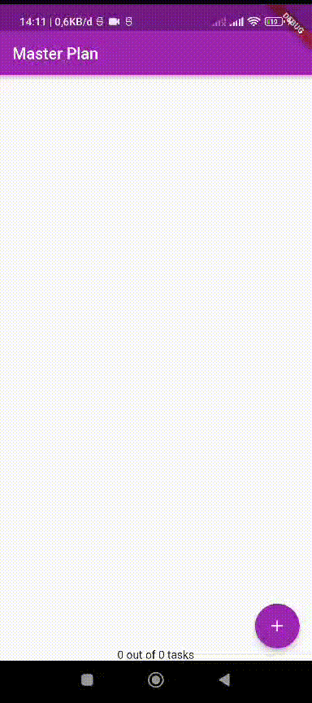
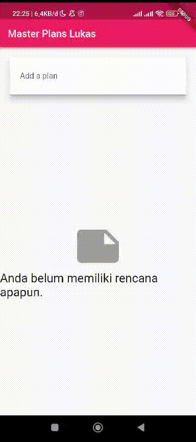
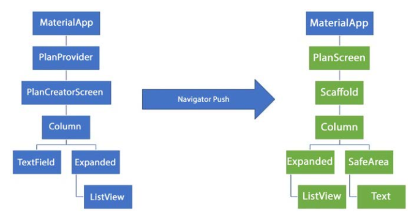

**Laporan Praktikum**
# **Pertemuan 11**
### **Dasar State Management**
------

### **Data Mahasiswa**

>
Nama : Lukas Valentino

>NIM : 2141720032

>Kelas : 3H

>Prodi : D-IV Teknik Informatika

>Jurusan : Teknologi Informasi

 

---------
 

### Tugas Praktikum 1: Dasar State dengan Model-View

1. Selesaikan langkah-langkah praktikum tersebut, lalu dokumentasikan berupa GIF hasil akhir praktikum beserta penjelasannya di file README.md! Jika Anda menemukan ada yang error atau tidak berjalan dengan baik, silakan diperbaiki.

2. Jelaskan maksud dari langkah 4 pada praktikum tersebut! Mengapa dilakukan demikian?
> Jawaban: Maksud dari langkah 4 adalah untuk mengelompokkan kode data layer ke dalam satu file. Hal ini bertujuan untuk mempermudah proses impor, terutama jika aplikasi berkembang dan memiliki lebih banyak model data.
>Sebelum langkah 4, kode data layer untuk Plan dan Task berada di file terpisah. Hal ini membuat proses impor kode data layer menjadi lebih rumit. Misalnya, jika kita ingin menggunakan model Plan di file plan_screen.dart, kita harus mengimpor file plan.dart terlebih dahulu.
>Dengan langkah 4, kita dapat mengimpor semua model data hanya dengan mengimpor file data_layer.dart. Hal ini akan membuat kode lebih ringkas dan mudah dibaca.

3. Mengapa perlu variabel plan di langkah 6 pada praktikum tersebut? Mengapa dibuat konstanta ?

>Jawaban : Variabel plan diperlukan di langkah 6 pada praktikum tersebut untuk menyimpan data rencana yang akan ditampilkan. Variabel ini dibuat konstanta agar nilainya tidak dapat diubah setelah deklarasinya.
>Mengapa perlu variabel plan?
>Variabel plan diperlukan untuk menyimpan data rencana yang akan ditampilkan. Data rencana ini terdiri dari nama rencana dan daftar tugas yang ada di dalam rencana tersebut.
>Mengapa dibuat konstanta?
>Variabel plan dibuat konstanta agar nilainya tidak dapat diubah setelah deklarasinya. Hal ini dilakukan karena data rencana harus tetap konsisten selama aplikasi berjalan. Jika nilai variabel plan dapat diubah, maka data rencana yang ditampilkan juga akan berubah.

4. Lakukan capture hasil dari Langkah 9 berupa GIF, kemudian jelaskan apa yang telah Anda buat!

5. Apa kegunaan method pada Langkah 11 dan 13 dalam lifecyle state ?
>Jawaban : Method initState() pada langkah 11 digunakan untuk menginisialisasi variabel scrollController. Variabel ini digunakan untuk melacak posisi scroll dari ListView.
>Method dispose() pada langkah 13 digunakan untuk melepaskan sumber daya yang digunakan oleh variabel scrollController. Hal ini penting untuk dilakukan agar memori tidak terpakai secara berlebihan.

6. Kumpulkan laporan praktikum Anda berupa link commit atau repository GitHub ke spreadsheet yang telah disediakan!

### Tugas Praktikum 2: InheritedWidget

1. Selesaikan langkah-langkah praktikum tersebut, lalu dokumentasikan berupa GIF hasil akhir praktikum beserta penjelasannya di file README.md! Jika Anda menemukan ada yang error atau tidak berjalan dengan baik, silakan diperbaiki sesuai dengan tujuan aplikasi tersebut dibuat.

2. Jelaskan mana yang dimaksud InheritedWidget pada langkah 1 tersebut! Mengapa yang digunakan InheritedNotifier?
>InheritedWidget adalah sebuah widget yang dapat digunakan untuk membagikan data atau informasi ke widget-widget lain di bawahnya dalam sebuah widget tree. InheritedWidget bekerja dengan cara mewariskan data atau informasi dari widget induknya ke widget-widget anak yang membutuhkannya.
>Pada langkah 1, kita membuat sebuah kelas InheritedWidget bernama PlanProvider. Kelas ini memiliki dua properti, yaitu notifier dan child. Properti notifier menyimpan data Plan yang akan dibagikan ke widget-widget lain. Properti child menyimpan widget yang akan dirender oleh InheritedWidget ini.
>Kelas PlanProvider mewarisi kelas InheritedNotifier. Kelas InheritedNotifier adalah subclass dari InheritedWidget yang memiliki kemampuan untuk mendeteksi perubahan pada data yang disimpannya. Ketika data yang disimpan oleh InheritedNotifier berubah, maka semua widget anak yang membutuhkan data tersebut akan di-rebuild.

>Oleh karena itu, kita menggunakan InheritedNotifier pada langkah 1 karena kita ingin memastikan bahwa semua widget anak yang membutuhkan data Plan akan di-rebuild ketika data Plan berubah.

3. Jelaskan maksud dari method di langkah 3 pada praktikum tersebut! Mengapa dilakukan demikian?

>Pada langkah 3, kita menambahkan dua method baru pada model class Plan. Method pertama bernama completedCount yang mengembalikan jumlah task yang telah selesai. Method kedua bernama completenessMessage yang mengembalikan pesan tentang status penyelesaian plan.

>Penambahan kedua method ini dilakukan untuk memudahkan proses perhitungan dan menampilkan status penyelesaian plan. Dengan adanya kedua method ini, kita tidak perlu lagi melakukan looping untuk menghitung jumlah task yang telah selesai atau membuat string pesan secara manual.

4. Lakukan capture hasil dari Langkah 9 berupa GIF, kemudian jelaskan apa yang telah Anda buat!

5. Kumpulkan laporan praktikum Anda berupa link commit atau repository GitHub ke spreadsheet yang telah disediakan!

Tugas Praktikum 3: State di Multiple Screens
1. Selesaikan langkah-langkah praktikum tersebut, lalu dokumentasikan berupa GIF hasil akhir praktikum beserta penjelasannya di file README.md! Jika Anda menemukan ada yang error atau tidak berjalan dengan baik, silakan diperbaiki sesuai dengan tujuan aplikasi tersebut dibuat.

2. Berdasarkan Praktikum 3 yang telah Anda lakukan, jelaskan maksud dari gambar diagram berikut ini!

>Diagram struktur widget di sebelah kiri menggambarkan bagaimana aplikasi terlihat saat pengguna sedang membuat rencana baru. Saat berada di layar pencipta rencana (PlanCreatorScreen), pengguna dapat berinteraksi dengan berbagai elemen seperti TextField dan Expanded di dalam sebuah Column. Penyusunan data rencana dan tampilan daftar rencana diatur oleh PlanProvider, yang merupakan bagian dari widget tree di bawah MaterialApp.
>Saat pengguna berpindah ke tampilan utama aplikasi (PlanScreen) di sebelah kanan, mereka dapat melihat daftar rencana yang telah dibuat sebelumnya. Data rencana masih dikelola oleh PlanProvider yang tetap berada di root widget tree untuk memfasilitasi akses lintas tampilan. Struktur tampilan menggunakan Column, Expanded, dan SafeArea untuk menyusun elemen-elemen, termasuk daftar rencana yang ditampilkan melalui ListView. Selain itu, terdapat elemen teks di bawah area aman yang mungkin menampilkan pesan terkait kelengkapan rencana.

3. Lakukan capture hasil dari Langkah 14 berupa GIF, kemudian jelaskan apa yang telah Anda buat!

4. Kumpulkan laporan praktikum Anda berupa link commit atau repository GitHub ke spreadsheet yang telah disediakan!