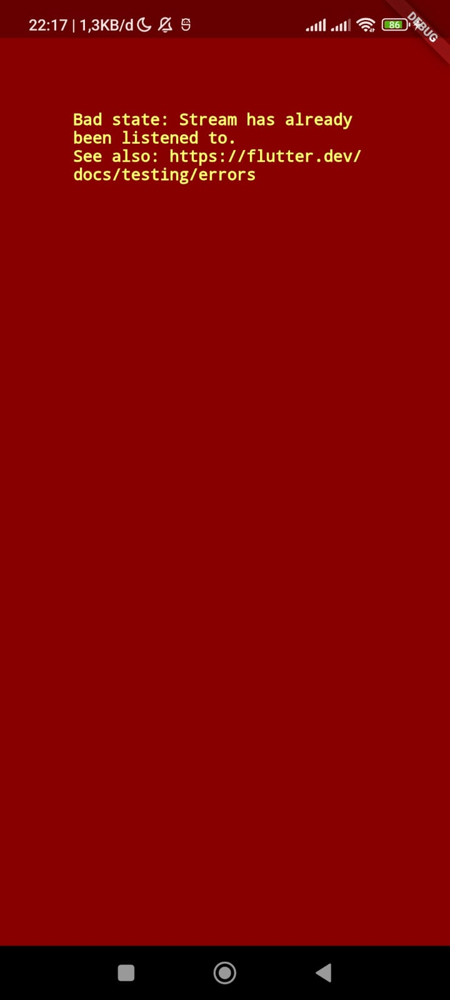

**Laporan Praktikum**
# **Pertemuan 13**
### **Lanjutan State Management dengan Streams**
------

### **Data Mahasiswa**

><p>Nama : Lukas Valentino<p>
>NIM : 2141720032<p>
>Kelas : 3H<p>
>Prodi : D-IV Teknik Informatika<p>
>Jurusan : Teknologi Informasi<p>

<br>


## Praktikum 1: Dart Streams

### Soal 1
- Tambahkan nama panggilan Anda pada title app sebagai identitas hasil pekerjaan Anda.

Jawab : 

```dart
 @override
  Widget build(BuildContext context) {
    return MaterialApp(
      title: 'Stream - Lukas',
```
- Gantilah warna tema aplikasi sesuai kesukaan Anda.

Jawab : 

```dart
theme: ThemeData(
        primarySwatch: Colors.deepOrange,
```

- Lakukan commit hasil jawaban Soal 1 dengan pesan "W13: Jawaban Soal 1"

### Soal 2
- Tambahkan 5 warna lainnya sesuai keinginan Anda pada variabel colors tersebut.

```dart
 Final List(Color) colors = [
    Colors.blueGrey,
    Colors.amber,
    Colors.deepPurple,
    Colors.lightBlue,
    Colors.teal,
    Colors.redAccent,
    Colors.indigo,
    Colors.yellow,
    Colors.limeAccent,
    Colors.orange
  ]; 
```

- Lakukan commit hasil jawaban Soal 2 dengan pesan "W13: Jawaban Soal 2"


### Soal 3
- Jelaskan fungsi keyword yield* pada kode tersebut!

Jawab : 

>Fungsi keyword yield* pada kode tersebut adalah untuk menghasilkan nilai dari stream Stream.periodic. Keyword yield* memungkinkan kita untuk menghasilkan nilai dari stream lain atau iterable.

- Apa maksud isi perintah kode tersebut?

Jawab : 

>Isi perintah kode tersebut adalah untuk menghasilkan stream warna yang berganti setiap satu detik. Stream ini dihasilkan dengan cara menghasilkan nilai dari stream Stream.periodic yang setiap detiknya menghasilkan nilai integer. Nilai integer tersebut kemudian digunakan untuk menentukan indeks warna yang akan dihasilkan.

- Lakukan commit hasil jawaban Soal 3 dengan pesan "W13: Jawaban Soal 3"

### Soal 4
- Capture hasil praktikum Anda berupa GIF dan lampirkan di README.

Jawab :
<center>

</center>

- Lakukan commit hasil jawaban Soal 4 dengan pesan "W13: Jawaban Soal 4"

### Soal 5
- Jelaskan perbedaan menggunakan listen dan await for (langkah 9) !

Jawab : 

>Listen:
>1. Sifat Sinkronus-Asinkronus: Metode listen bersifat asinkronus, yang berarti bahwa eksekusi program dapat melanjutkan ke baris kode berikutnya tanpa menunggu pengiriman data ke stream selesai.
>2. Fleksibilitas Handling: Anda dapat menggunakan metode listen untuk menentukan handler fungsi yang akan dijalankan setiap kali ada perubahan pada stream.
>3. Non-blocking: Penggunaan listen memungkinkan eksekusi program untuk melanjutkan ke baris berikutnya tanpa harus menunggu setiap data diambil dari stream.

> Await for:
>1. Sifat Sinkronus: Metode await for bersifat sinkronus, yang berarti bahwa eksekusi program akan tetap menunggu hingga ada data yang tersedia di stream sebelum melanjutkan ke baris kode berikutnya.
>2. Penggunaan Iterator: Penggunaan await for mirip dengan penggunaan iterator untuk mengonsumsi nilai dari stream secara satu per satu.
>3. Blocking: Penggunaan await for akan memblokir eksekusi program sampai data tersedia di stream atau stream ditutup.

- Lakukan commit hasil jawaban Soal 5 dengan pesan "W13: Jawaban Soal 5"

## Praktikum 2: Stream controllers dan sinks

### Soal 6
- Jelaskan maksud kode langkah 8 dan 10 tersebut!

Jawab : 

>Langkah 8: Edit initState()
>Metode initState() dipanggil ketika widget pertama kali dibuat. Dalam langkah ini, kode sedang membuat objek NumberStream dan objek StreamController. StreamController digunakan untuk mengontrol aliran data yang dikeluarkan oleh NumberStream. Aliran kemudian didengarkan, dan metode setState() dipanggil setiap kali peristiwa baru dikeluarkan. Ini memastikan bahwa widget diperbarui setiap kali nomor terbaru diterima.

>Langkah 10: Tambah method addRandomNumber()
>Metode addRandomNumber() digunakan untuk menambahkan nomor acak ke aliran data. Metode ini pertama-tama membuat objek Random dan kemudian memanggil metode nextInt() untuk mendapatkan nomor acak antara 0 dan 9. Nomor acak kemudian ditambahkan ke aliran menggunakan metode addNumberToSink().


- Capture hasil praktikum Anda berupa GIF dan lampirkan di README.
Lalu lakukan commit dengan pesan "W13: Jawaban Soal 6".

Jawab :
<center>

</center>

### Soal 7
- Jelaskan maksud kode langkah 13 sampai 15 tersebut!

Jawab : 
>Pada langkah 13, kita menambahkan method addError() ke kelas Stream. Method ini digunakan untuk menambahkan error ke stream.
>Pada langkah 15, kita mengedit method addRandomNumber(). Kita mengomentari dua baris kode yang sebelumnya digunakan untuk menambahkan random number ke stream. Kemudian, kita menambahkan kode baru untuk menambahkan error ke stream.

- Kembalikan kode seperti semula pada Langkah 15, comment addError() agar Anda dapat melanjutkan ke praktikum 3 berikutnya.

Jawab : 
```dart
  // addError() {
  //   controller.sink.addError('error');
  // }
```

- Lalu lakukan commit dengan pesan "W13: Jawaban Soal 7".

Jawab :
<center>

</center>


### Soal 8
- Jelaskan maksud kode langkah 1-3 tersebut!

Jawab : 
>Langkah 1
>Pada langkah ini, kita menambahkan variabel baru bernama transformer di dalam class _StreamHomePageState. Variabel ini akan digunakan untuk menyimpan objek StreamTransformer.

>Langkah 2
>Pada langkah ini, kita menambahkan kode untuk membuat objek StreamTransformer. Objek ini akan digunakan untuk mengubah data yang diterima dari stream. Dalam kasus ini, kita akan mengubah data integer menjadi integer yang dikalikan dengan 10.

>Langkah 3
>Pada langkah ini, kita melakukan edit kode di initState(). Kita menambahkan kode untuk menggunakan objek transformer untuk mengubah data yang diterima dari stream.

- Capture hasil praktikum Anda berupa GIF dan lampirkan di README.

Jawab :
<center>

</center>

- Lalu lakukan commit dengan pesan "W13: Jawaban Soal 8".

### Soal 9
- Jelaskan maksud kode langkah 2, 6 dan 8 tersebut!

Jawab : 
>Langkah 2
>Pada langkah ini, kita menambahkan kode untuk membuat objek NumberStream dan NumberStreamController. Objek NumberStream akan digunakan untuk menghasilkan stream integer secara acak. Objek NumberStreamController akan digunakan untuk mengontrol stream tersebut.

>Langkah 6
>Pada langkah ini, kita menambahkan kode untuk membatalkan subscription di dispose(). Subscription ini harus dibatalkan untuk mencegah memory leak.

>Langkah 8
>Pada langkah ini, kita menambahkan kode untuk memeriksa apakah stream telah ditutup sebelum menambahkan data ke stream. Jika stream telah ditutup, kita akan mengubah nilai variabel lastNumber dengan nilai -1.

- Capture hasil praktikum Anda berupa GIF dan lampirkan di README.

Jawab :
<center>

</center>

- Lalu lakukan commit dengan pesan "W13: Jawaban Soal 9".

### Soal 10
- Jelaskan mengapa error itu bisa terjadi ?


<center>

</center>

Jawab :

>Kesalahan tersebut terjadi ketika mencoba untuk menambahkan atau membuat dua langganan pada stream yang sama, tanpa membatalkan langganan sebelumnya. Hal tersebut terjadi ketika inisialisasi langganan2 pada metode initState() karena sudah ada inisialisasi langganan untuk menangani stream yang sama pada satu waktu.

### Soal 11
- Jelaskan mengapa hal itu bisa terjadi ?

Jawab : 
>Saat tombol "New Random Number" ditekan, maka akan menghasilkan dua angka random yang sama. Angka-angka tersebut merupakan output dari stream yang dipanggil oleh objek subscription dan subscription2. Stream tersebut akan mengembalikan nilai berupa event (angka random) yang dipisahkan dengan tanda "-".
>Saat tombol "Stop Stream" ditekan, maka akan menghentikan langganan terhadap stream. Hal ini menyebabkan stream tidak lagi bisa mengeluarkan output, meskipun tombol "New Random Number" ditekan.

- Capture hasil praktikum Anda berupa GIF dan lampirkan di README.

Jawab :
<center>

</center>

- Lalu lakukan commit dengan pesan "W13: Jawaban Soal 10,11".


